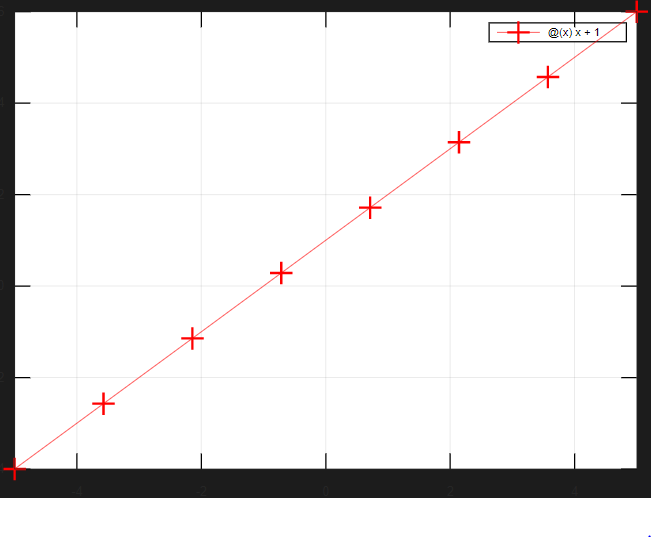

# I. Matlab introduction

## 1. Vector

### **Exercise 1**

Define a row vector x, one row, five column with value = (1, 2, 3, 4, 5); find the value x(3) + x(2) = ?

```matlab
% ©2022 Quang Anh.
clc;
clear;

%Define a row vector x
x=[1 2 3 4 5];
fprintf	('Row vector x = \n');
disp(x);

%find the value x(3)+x(2)
x32 = x(3)+x(2);
fprintf	('\nx32 = x(3)+x(2) = ');
disp(x32);
```

The result is: `x32 = x(3)+x(2) = 5`

### **Exercise 2**

Define a **column** vector x = (1, 2, 3, 4, 5); Transpose this vector?

```matlab
% ©2022 Quang Anh.
clc;
clear;

% Column vector x
x_row=[1 2 3 4 5]
x = [1;2;3;4;5];
fprintf ('Column vector x = \n');
disp(x);

% Transpose vector x
xT = x';
fprintf ('\nTranspose of vector x: xT = \n');
disp(xT);
```

The result is:

```matlab
x_row =

   1   2   3   4   5

Column vector x = 
   1
   2
   3
   4
   5

Transpose of vector x: xT = 
   1   2   3   4   5
```

### Exercise 3

Calculate a = 1 + 2 + … + 100 using the function *sum*

```matlab
% ©2022 Quang Anh.
clc;
clear;

%Calculate: a = 1 + 2 + ... + 100 using the function "sum"
a = sum(1:100)
```

The result of a is 5050.

### Exercise 4

Define the symbolic function x + y using the function *syms*. Find the value of f at x = 1 and y = 2

```matlab
% ©2022 Quang Anh.
%Define th symbolic function x + y using the function syms. Find the value of f at x = 1 and y = 2
clc;
clear;

syms f(x,y)
f(x,y) = x+y

x=1
y=2
f(x,y)
```

The value of f is 3

```
Symbolic pkg v2.9.0: Python communication link active, SymPy v1.5.1.
f(x, y) = (symfun) x + y
x = 1
y = 2
ans = (sym) 3
```

### Exercise 5

Use the function *symsum* to calculate

a) $\sum_{k=1}^{n} \left ( \frac{1}{k} - \frac{1}{1 + k} \right )$

```matlab
% ©2022 Quang Anh.
%Use the function symsum to calculate

clc;
clear;

syms k n; 

F = symsum (1/k - 1/(k+1), k, 1, n)
```

The result is:

```matlab
F = (sym)

        1  
  1 - ─────
      n + 1
```

b) $\sum_{n = 1}^{\infin} \frac{1}{n^2}$

```matlab
% ©2022 Quang Anh.
%Use the function symsum to calculate

clc;
clear;

syms n; 

F = symsum (1/n^2, n, 1, Inf)
```

The result is:

```matlab
F = (sym)

   2
  π 
  ──
  6
```

## 2. Matrix

### Exercise 1

a) Define matrix $A = \begin{bmatrix}
0 & 0 & 0 \\
0 & 0 & 0 \\
0 & 0 & 0 \\
\end{bmatrix}$by two approaches: Define element by element and used the function *zeros*

```matlab
% ©2022 Quang Anh.
% Define matrix A by two approaches
clc;
clear;

% Method 1: Define element by element
A1 = [0 0 0;0 0 0;0 0 0];
% Showing the result
fprintf('\nA1 = \n');
disp(A1);

% Method 2: the function zeros
A2 = zeros(3:3);
% Showing the result
fprintf('\nA2 = \n');
disp(A2);
```

The result is:

```
A1 = 
   0   0   0
   0   0   0
   0   0   0

A2 = 
   0   0   0
   0   0   0
   0   0   0
```

b) Change the diagonal of A to 1 without define the matrix again using *diag*

```matlab
% ©2022 Quang Anh.
% Change the diagonal of A to 1 without define the matrix again
%help diag
clc;
clear;

A = zeros(3:3)

A(1,1) = 1;
A(2,2) = 1;
A(3,3) = 1
%A = diag([1 1 1], 0)
```

The result is:

```
A =

   0   0   0
   0   0   0
   0   0   0

A =

   1   0   0
   0   1   0
   0   0   1
```

c) Define B = A transposed

```matlab
% ©2022 Quang Anh.
% Define B = A transposed
clc;
clear;

A = zeros(3:3)

A = diag([1 1 1], 0)

A(2,1) = 2;
A(3,1) = 3;
A(3,2) = 4;

A

B = A'
```

The result is:

```
A =

Diagonal Matrix

   1   0   0
   0   1   0
   0   0   1

A =

   1   0   0
   2   1   0
   3   4   1

B =

   1   2   3
   0   1   4
   0   0   1
```

d) Calculate A+B, A-B, A*B and A.*B. Give remark about the results of A*B and A.*B

```matlab
% ©2022 Quang Anh.
% Calculate A+B, A-B, A*B and A.*B
clc;
clear;

A = zeros(3:3);

A = diag([1 1 1], 0);

A(2,1) = 2;
A(3,1) = 3;
A(3,2) = 4;

A

B = A'

fprintf('\nA+B = \n');
disp(A+B);
fprintf('\nA-B = \n');
disp(A-B);
fprintf('\nA*B = \n');
disp(A*B);
fprintf('\nA.*B = \n');
disp(A.*B);
```

The results are:

```
A =

   1   0   0
   2   1   0
   3   4   1

B =

   1   2   3
   0   1   4
   0   0   1

A+B = 
   2   2   3
   2   2   4
   3   4   2

A-B = 
   0  -2  -3
   2   0  -4
   3   4   0

A*B = 
    1    2    3
    2    5   10
    3   10   26

A.*B = 
   1   0   0
   0   1   0
   0   0   1
```

e) Reduce the size of A to 2x2 by removing row 3 and column 3 of the original matrix. Do the same for B but remove row 1 and column 1. *Hint: use the operator “:”*

```matlab
% ©2022 Quang Anh.
% Reduce the size of A to 2x2
clc;
clear;

A = zeros(3:3);
A = diag([1 1 1], 0);

A(2,1) = 2;
A(3,1) = 3;
A(3,2) = 4;

A 
size(A)

%A(3,:) = []
%A(:, 3) = []

A1 = A(1:2, 1:2)

B = A'

B1 = B(2:3, 2:3)
```

The result is:

```
A =

   1   0   0
   2   1   0
   3   4   1

ans =

   3   3

A1 =

   1   0
   2   1

B =

   1   2   3
   0   1   4
   0   0   1

B1 =

   1   4
   0   1
```

f) What’s the difference A(1:3) and a(1:3,1) or A(:,1)?

```matlab
% ©2022 Quang Anh.
% What’s the difference A(1:3) and a(1:3,1) or A(:,1)?
clc;
clear;

A = zeros(3:3);
A = diag([1 1 1], 0);

A(2,1) = 2;
A(3,1) = 3;
A(3,2) = 4;
A

A1 = A(1:3)
A2 = A(1:3,1)
A3 = A(:, 1)
```

The results are:

```matlab
A =

   1   0   0
   2   1   0
   3   4   1

A1 =

   1   2   3

A2 =

   1
   2
   3

A3 =

   1
   2
   3
```

## 3. Function

### Exercise 1

Write a function that calculates the mean of a vector

*Application:* vector x = 1:3:100

```matlab
% ©2022 Quang Anh.
% Write a function that calculates the mean of a vector.
clc;
clear;

function [mean] = stats(x)
    Number_of_elements = length(x)
    mean = sum(x)/Number_of_elements;
end

x = [1:3:100]
mean = stats(x)
```

The mean of a vector is 50500

```
x =

 Columns 1 through 13:

     1     4     7    10    13    16    19    22    25    28    31    34    37

 Columns 14 through 26:

    40    43    46    49    52    55    58    61    64    67    70    73    76

 Columns 27 through 34:

    79    82    85    88    91    94    97   100

Number_of_elements = 34
mean = 50.500
```

### Exercise 2

Write a function that solves the quadratic equation $ax^2 + bx + c = 0$

*Application:* equation $x^2 + 2x - 3 = 0$

```matlab
% ©2022 Quang Anh.
% Write a function that solves the quadratic equation ax^2 + bx + c = 0
clc;
clear;

function [x1 x2] = quadratic(a, b, c)
    D = b^2-4*a*c;
    x1 = (-b - sqrt(D))/(2*a);
    x2 = (-b + sqrt(D))/(2*a);
end
    
a = 1;
b = 2;
c = -3;
[x1 x2] = quadratic(a, b, c)
```

The results are: $x_1 = -3, x_2 = 1$

## 4. if else structure

### Exercise 1

Write brief scripts to evaluate the following functions

m = n + 1 with n > 1

m = n - 1 with n < 1

*Application*

a) n = 5. The result is 6

```matlab
% ©2022 Quang Anh.
%Write brief scripts to evaluate the following functions. 
% m = n + 1 with n >1
% m = n - 1 with n <1
clc;
clear;

n = 5
%n = -5

if n>1
    m = n+1
else
    m = n-1
end
```

b) n = -5. The result m is -6

```matlab
% ©2021 HP.
%Write brief scripts to evaluate the following functions. 
% m = n + 1 with n >1
% m = n - 1 with n <1
clc;
clear;

%n = 5
n = -5

if n>1
    m = n+1
else
    m = n-1
end
```

### Exercise 2

Write brief scripts to evaluate the following functions

y = 4x with 0 < x < 10

y = 10x with 10 < x < 40

y = x with x > 40 and x < 0

*Application*

a) x = 5

```matlab
% ©2022 Quang Anh.
% Write brief scripts to evaluate the following functions. 
% y=4x with 0<x <10
% y=10x with 10<x<40
% y = x with x > 40 and x < 0

clc;
clear;

x = 5

if (0<x & x<10)
    y = 4*x
elseif (10<x & x<40)
    y = 10*x
else
    y = x
endif
```

b) x = -5

```matlab
% ©2022 Quang Anh.
% Write brief scripts to evaluate the following functions. 
% y=4x with 0<x <10
% y=10x with 10<x<40
% y = x with x > 40 and x < 0

clc;
clear;

x = -5

if (0<x & x<10)
    y = 4*x
elseif (10<x & x<40)
    y = 10*x
else
    y = x
endif
```

It was error

```matlab
warning: Matlab-style short-circuit operation performed for operator &
warning: called from
    1a_I_4_2.m at line 16 column 1

warning: Matlab-style short-circuit operation performed for operator &
warning: called from
    1a_I_4_2.m at line 18 column 1
```

c) x = 20. The result of y is 200

```matlab
% ©2022 Quang Anh.
% Write brief scripts to evaluate the following functions. 
% y=4x with 0<x <10
% y=10x with 10<x<40
% y = x with x > 40 and x < 0

clc;
clear;

%x = 5
%x = -5
x = 20

if (0<x & x<10)
    y = 4*x
elseif (10<x & x<40)
    y = 10*x
else
    y = x
endif
```

### Exercise 3

Electricity bill: In Vietnam, the electricity price varies with the number kWh, e.g the first 50 kWh will be cheaper than the next 50 kWh. In particular:

- From 0 to 50 kWh: 1.484 VND / kWh
- From 51 to 100 kWh: 1.533 VND / kWh
- From 101 to 200 kWh: 1.786 VND / kWh
- From 201 to 300 kWh: 2.242 VND / kWh
- From 301 to 400 kWh: 2.503 VND / kWh
- From 400 kWh: 2.587 VND / kWh

Write a script to calculate the price of electricity with input is the number of kWh

```matlab
% ©2022 Quang Anh.
% Electricity bill
clc;
clear;

function price = Electricity(P)
    price_50 = 50*1484;
    price_100 = price_50 + (100-50)*1533;
    price_200 = price_100 + (200-100)*1786;
    price_300 = price_200 + (300-200)*2242;
    price_400 = price_300 + (400-300)*2503;
    if P<=50
        price = P*1484;
    elseif P<=100
        price = price_50 + (P-50)*1533;
    elseif P<=200
        price = price_100 + (P-100)*1786;
    elseif P<=300
        price = price_200 + (P-200)*2242;
    elseif P<=400
        price = price_300 + (P-300)*2503;
    else
        price = price_400 + (P-400)*2587;
    end
end

P = 200;
price_200 = Electricity(P)

P = 201;
price_201 = Electricity(P)

price_201 - price_200
```

The result is:

```
price_200 = 329450
price_201 = 331692
ans = 2242
```

## 5. For loop

### Exercise 1

Write a script to calculate these sums:

a) $1^2 + 2^2 + 3^2 + ... + 1000^2$

```matlab
% ©2022 Quang Anh.
% For loop
clc;
clear;

a = 0;
for i=1:1000
    disp(i)
    a += i^2
end

%a
```

The result is 333833500

b) 20!

```matlab
% ©2022 Quang Anh.
% For loop
clc;
clear;

b = 1;
for i=1:20
    disp(i)
    b *= i
    % b = b*i
end

%b
```

The result is:

```txt
1
b = 1
2
b = 2
3
b = 6
4
b = 24
5
b = 120
6
b = 720
7
b = 5040
8
b = 40320
9
b = 362880
10
b = 3628800
11
b = 3.9917e+07
12
b = 4.7900e+08
13
b = 6.2270e+09
14
b = 8.7178e+10
15
b = 1.3077e+12
16
b = 2.0923e+13
17
b = 3.5569e+14
18
b = 6.4024e+15
19
b = 1.2165e+17
20
b = 2.4329e+18
```

c) $1 - \frac{1}{3} + \frac{1}{5} - \frac{1}{7} + \frac{1}{9} - ... - \frac{1}{1003}$

```matlab
% ©2022 Quang Anh.
% For loop
clc;
clear;

c = 0;
k = 1;
for i=1:2:1003
    k += 1
    c += (-1)^k/(i);
end

c
```

The result of c is 0.7849

d) Prove that: $\frac{1}{1^2 \cdot 3^2} + \frac{1}{3^2 \cdot 5^2} + \frac{1}{5^2 \cdot 7^2} + ... = \frac{\pi^2 - 8}{16}$

```matlab
% ©2022 Quang Anh.
% For loop
clc;
clear;

d1 = (pi^2 - 8)/16

d2 = 0;
for i=1:2:1005
    d2 += i^(-2)*(i+2)^(-2);
end

d2
```

The result of d1 and d2 are 0.1169

### Exercise 2

Write a script to calculate:

a) Combination of a set $(C_{k}^{n} = \frac{n!}{k!(n - k)!})$

b) Permutation of a set $(A_{n}^{k} = \frac{n!}{(n - k)!})$

*Hint: write a function to calculate the factorial of a number first, then use the function to write the required script)*

```matlab
% ©2022 Quang Anh.
% For loop
clc;
clear;

function Fac = Factorial(n)
    Fac = 1;
    for i=1:n
        Fac *= i;
    end
end

n = 6
k = 3

Fac_n = Factorial(n)
Fac_k = Factorial(k)

% a. Combination
C_k_n = Factorial(n)/(Factorial(k)*Factorial(n-k))

% b. Permutation
A_k_n = Factorial(n)/(Factorial(n-k))
```

The result is:

```
n =  6
k =  3
Fac_n =  720
Fac_k =  6
C_k_n =  20
A_k_n =  120
```

## 6. While loop

### Exercise 1

a) Write code with *while loop* that makes the computer count number from 1 to N (N: integer), for example from 1 to 5, there are 5 number.

```matlab
% ©2022 Quang Anh.
% While loop
clc;
clear;

n = 0;
while n<10
    n += 1;
    disp(n);
end
```

The result is:

```
1
2
3
4
5
6
7
8
9
10
```

b) Write code with *while loop* that makes the computer count only the odd number from 1 to N (N: integer), for example from 1 to 5, there are 3 odd number

```matlab
% ©2022 Quang Anh.
% While loop
clc;
clear;

n = 0;
while n<10
    n += 1;
    if mod(n,2)!= 0 %Remainder after division (modulo operation)
        disp(n);
    end
end
```

The result is:

```matlab
1
3
5
7
9
```

### Exercise 2

Calculate the sum S of elements $a = \sqrt{2i - 1}, i = 1, 2,...,$ until the sum will exceed 20 using *while loop*.

```matlab
% ©2022 Quang Anh.
% While loop
clc;
clear;

S = 0;
i = 0;
while S < 20
    i += 1
    a = sqrt(2*i - 1)
    S += a
    fprintf("\n")
end
```

The results are:

```
i = 1
a = 1
S = 1

i = 2
a = 1.7321
S = 2.7321

i = 3
a = 2.2361
S = 4.9681

i = 4
a = 2.6458
S = 7.6139

i = 5
a = 3
S = 10.614

i = 6
a = 3.3166
S = 13.930

i = 7
a = 3.6056
S = 17.536

i = 8
a = 3.8730
S = 21.409
```

### Exercise 3

Doubling time of an investiment: write a script to calculate hold long it will take for our bank investiment to double. Suppose that the interest rate is 10% per year and all the interest is added to the initial investiment

```matlab
% ©2022 Quang Anh.
% While loop - Doubling time of an investment
clc;
clear;

function time = InvestTime(InvestedMoney, Target, Rate)
time = 0;
while InvestedMoney < Target
     time
     InvestedMoney += InvestedMoney*Rate;
     time += 1;
end
end

InvestedMoney = 100
Target = 2*InvestedMoney
Rate = 0.1
time = InvestTime(InvestedMoney, Target, Rate);
fprintf('\nNumber of years needed to double the invested money: time = ');
disp (time);
```

The results are:

```
InvestedMoney = 100
Target = 200
Rate = 0.100000000000000
time = 0
time = 1
time = 2
time = 3
time = 4
time = 5
time = 6
time = 7

Number of years needed to double the invested money: time = 8
```

## 7. Graphic

### Exercise 1

1. Draw the graph of a linear function y = x + 1 in the range of x = -5 to x = 5

*Hint*: consult help to know how to use the function *linspace* and *plot*

```matlab
% ©2022 Quang Anh.
clc;
clear;
clf;

f_x = @(x) x+1
fplot(f_x, [-5 5], 'r-+');

grid on
```

The result is:



b) Change the color and the pattern of the line using *plot* function (*Hint: the option for colors and patterns can be found in the help sections)*

```matlab
% ©2022 Quang Anh.
clc;
clear;
clf;

fplot(@(x) x+1, [-5 5], 'b-+');
grid on
```

The result is:


c) Plot the line y = -x + 2 on the same plot

```matlab
% ©2022 Quang Anh.
clc;
clear;
clf;
    
hold on

fplot(@(x) x+1, [-5 5], 'g');

pause(2);

fplot(@(x) -x+2, [-5 5], 'r');
grid on

hold off
```

The results are:


d) Add title, legend and labels for each axis

```matlab
% ©2022 Quang Anh.
clc;
clear;
clf;
    
hold on

fplot(@(x) x+1, [-5 5], 'g-');
fplot(@(x) -x+2, [-5 5], 'r--');

title('Line Plot of y = x+1 and y = -x+2');
xlabel('-5 < x < 5');
ylabel('-5 < y < 5');
legend({'y = x+1','y = -x+2'},'Location','northeast');
grid on

hold off
```

The result is:

```matlab
% ©2022 Quang Anh.
clc;
clear;
clf;
    
hold on

fplot(@(x) x+1, [-5 5], 'g');
fplot(@(x) -x+2, [-5 5], 'r--');

title('Line Plot of y = x+1 and y = -x+2');
xlabel('-5 < x < 5');
ylabel('-5 < y < 5');
legend({'y = x+1','y = -x+2'},'Location','northeast');
grid on

hold off
```


