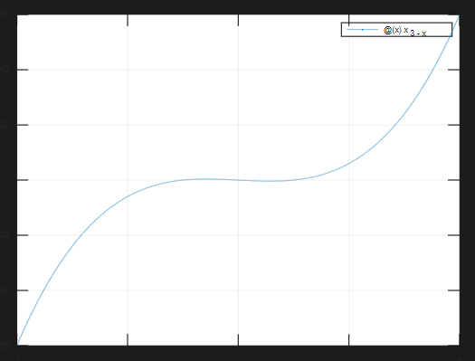

# I. Matlab function

## 1. Solve, fzero

### Exercise 1

Use either *solve* or *fzero*, as appropriate, to solve the following equations

a) 67x + 32 = 0 (exact solution)

```matlab
% ©2022 Quang Anh.
%Solve,fzero

clc;
clear;
clf;

%syms x
%S = fsolve(67*x + 32 == 0, x)

fnc = @(x) 67*x + 32
S = fzero(y, 10)

hold on
fplot(y, 'r')
plot(S, y(S), 'b+')
grid on
hold off
```
b) 67x + 32 = 0 (numerical solution to 15 places) - hint: *format long*
```matlab
format long
func = @(x) 67*x + 32;
x = fzero(func, 1)
```
The result is x = -0.477611940298508
c) $x^3 + px + q = 0$. (Solve for x in terms of p and q).

```matlab
% ©2022 Quang Anh.
%Solve,fzero

clc;
clear;

%syms x p q
%S = solve(x^3 + p*x + q == 0, x)

%S = solve(x^3 + 3*x + 6 == 0, x)

syms x p q
S = solve(x^3 + p*32 + q == 0, x)
```

The result is:

```
S = (sym 3×1 matrix)

  ⎡           3 ___________            ⎤
  ⎢           ╲╱ -32⋅p - q             ⎥
  ⎢                                    ⎥
  ⎢  3 ___________        3 ___________⎥
  ⎢  ╲╱ -32⋅p - q    √3⋅ⅈ⋅╲╱ -32⋅p - q ⎥
  ⎢- ───────────── - ──────────────────⎥
  ⎢        2                 2         ⎥
  ⎢                                    ⎥
  ⎢  3 ___________        3 ___________⎥
  ⎢  ╲╱ -32⋅p - q    √3⋅ⅈ⋅╲╱ -32⋅p - q ⎥
  ⎢- ───────────── + ──────────────────⎥
  ⎣        2                 2         ⎦
```

d) $e^x = 8x - 4$ (all real solutions). It helps to draw a picture first.

```

```

## 2. Plot

### Exercise 1

1. Use *plot* to graph the following functions

a) $y = x^3 - x$ for $-4 \leq x \leq 4$

```matlab
% ©2022 Quang Anh.
clc;
clear;
clf;

fplot(@(x) x^3 - x, [-4 4]);
grid on
```

The result is:



b) $y = tan \left (\frac{x}{2} \right )$ for $-\pi \leq x \leq \pi$, $-10 \leq y \leq 10$. (Hint: first draw the plot; then use axis)

```matlab
% ©2022 Quang Anh.
clc;
clear;
clf;

fplot(@(x) tan(x/2), [-pi pi -10 10]);

grid on
```

The result is:


c) $y = e^{-x/2}$ and $y = x^4 - x^2$ for $-1.5 \leq x \leq 1.5$ (on the same set of axes)

```matlab
% ©2022 Quang Anh.
clc;
clear;
clf;

hold on

fplot(@(x) e^(-x/2), [-1.5, 1.5]);
fplot(@(x) x^4 - x^2, [-1.5, 1.5]);
grid on
hold off
```

The result is:


# II. Matlab - numerical method

## 1. Bisection method

Given an M-file to implement the bisection method:

```matlab
function [root,fx,ea,iter]=bisection(func,xl,xu,es,maxit)
% bisect: root location zeroes
% [root,fx,ea,iter]=bisect(func,xl,xu,es,maxit,p1,p2,...):
% uses bisection method to find the root of func
% input:
% func = name of function
% xl, xu = lower and upper guesses
% es = desired relative error (default = 0.0001%)
% maxit = maximum allowable iterations (default = 50)
% p1,p2,... = additional parameters used by func
% output:
% root = real root
% fx = function value at root
% ea = approximate relative error (%)
% iter = number of iterations
if nargin<3,error('at least 3 input arguments required'),end
test = func(xl)*func(xu);
if test>0,error('no sign change'),end
if nargin<4||isempty(es), es=0.0001;end
if nargin<5||isempty(maxit), maxit=50;end
iter = 0; xr = xl; ea = 100;
while (1)
xrold = xr;
xr = (xl + xu)/2;
iter = iter + 1;
if xr ~= 0,ea = abs((xr - xrold)/xr) * 100;end
test = func(xl)*func(xr);
if test < 0
xu = xr;
elseif test > 0
xl = xr;
else
ea = 0;
end
if ea <= es || iter >= maxit,break,end
end
root = xr;
fx = func(xr);
```

### Exercise 1

Use the function file above to find the square root of 2, taking 1 and 2 as initial values of $x_i$ and $x_n$. Continue bisecting until the maximum error is less than 0.05

```matlab
% (c)2022 Quang Anh.
clc;
clear;
clf;
fprintf('\n--------------------------------------\n')
%--------------------------------------
fprintf('Labwork 2: Matlab-numerical method\n');
fprintf('Part 1: Bisection method\n\n');
%--------------------------------------
func = @(x) x^2-2;
fprintf('func = ');
disp(func(1.4));
xl = 1;
xu = 2;
es = 0.05;
maxit = 100;
[root,fx,ea,iter]=bisection(func,xl,xu,es,maxit);
fprintf('- real root = %f\n', root);
fprintf('- function value at root = %f\n', fx);
fprintf('- approximate relative error (%%) = %f\n', ea);
fprintf('- number of iterations = %d\n', iter);
%--------------------------------------
%GRAPHIC ANIMATION
animate = 1;
%--------------------------------------
grid on
hold on
fplot(func, [xl xu]);
plot(root, 0, 'r+');
leg = sprintf('Square root of x: (%f, 0)',root);
xlabel('x');
ylabel('y');
legend({'y = x^2-2',leg},'Location','northeast');
%--------------------------------------
RootValue = [];
if animate == 1
    for maxit=1:11
        [root,fx,ea,iter]=bisection(func,xl,xu,es,maxit);
        RootValue = [RootValue;root];
    end
    for maxit=1:11
        fprintf('Root value = %f', RootValue(maxit));
        plot(RootValue(maxit), 0);
        pause(0.5);
    end
end
hold off
```

The result is:

```
- real root = 1.414551
- function value at root = 0.000954
- approximate relative error (%) = 0.034518
- number of iterations = 11
```


### Exercise 2

Use the function file above to Determine the positive real root of $ln(x^2) = 0.7$ using three iterations of the bisection method, with initial guesses of $x_i = 0.5$ and $x_u = 2$

```matlab
% (c)2022 Quang Anh.
clc;
clear;
clf;
fprintf('\n--------------------------------------\n')
fprintf('Labwork 2: Matlab-numerical method\n');
fprintf('\n--------------------------------------\n')
fprintf('Part 1: Bisection method\n\n');
%--------------------------------------
func = @(x) log(x^2) - 0.7;
fprintf('func = ');
disp(func);
xl = 0.5;
xu = 2;
es = 0.05;
maxit = 100;

[root,fx,ea,iter]=bisection(func,xl,xu,es,maxit);
fprintf('- real root = %f\n', root);
fprintf('- function value at root = %f\n', fx);
fprintf('- approximate relative error (%%) = %f\n', ea);
fprintf('- number of iterations = %d\n', iter);
%--------------------------------------
%GRAPHIC ANIMATION
animate = 1;
%--------------------------------------
grid on
hold on
i = iter;
fplot(func, [xl xu]);
plot(root, 0, 'r+');
leg = sprintf('Square root of x: (%f, 0)',root);
xlabel('x');
ylabel('y');
legend({'log(x^2) - 0.7',leg},'Location','northeast');
%--------------------------------------
RootValue = [];
if animate == 1
    for maxit=1:i
        [root,fx,ea,iter]=bisection(func,xl,xu,es,maxit);
        RootValue = [RootValue;root];
    end
    for maxit=1:i
        fprintf('Root value = %f', RootValue(maxit));
        plot(RootValue(maxit), 0);
        pause(0.5);
    end
end
hold off
```

The result is:

```
- real root = 1.418823
- function value at root = -0.000344
- approximate relative error (%) = 0.025811
- number of iterations = 12
```


### Exercise 3

Write your script file to implement the Bisection method for solving the equation: $x^2 + 2x - 3 = 0$

```matlab
% (c)2022 Quang Anh.
clc;
clear;
clf;

func = @(x) x^2 + 2*x -3;

xl = 0.5;
xu = 2;
es = 0.05;
maxit = 100;

[root,fx,ea,iter]=bisection(func,xl,xu,es,maxit);
fprintf('- real root = %f\n', root);
fprintf('- function value at root = %f\n', fx);
fprintf('- approximate relative error (%%) = %f\n', ea);
fprintf('- number of iterations = %d\n', iter);

%--------------------------------------
%GRAPHIC ANIMATION
animate = 1;
%--------------------------------------
grid on
hold on
i = iter;
fplot(func, [xl xu]);
plot(root, 0, 'r+');
leg = sprintf('Square root of x: (%f, 0)',root);
xlabel('x');
ylabel('y');
legend({'x^2 + 2*x -3',leg},'Location','northeast');
%--------------------------------------
RootValue = [];
if animate == 1
    for maxit=1:i
        [root,fx,ea,iter]=bisection(func,xl,xu,es,maxit);
        RootValue = [RootValue;root];
    end
    for maxit=1:i
        maxit
        fprintf('Root value = %f', RootValue(maxit));
        plot(RootValue(maxit), func(RootValue(maxit)));
        pause(1.5);
    end
end
hold off
```

The result is:

```
- real root = 0.999878
- function value at root = -0.000488
- approximate relative error (%) = 0.036626
- number of iterations = 12
```


## 2. Newton Raphson method

Newton’s method may be used to solve a general equation f(x) = 0 by repeating the assignment

$$
x \ becomes \ x - \frac{f(x)}{f'(x)}
$$

where f’(x) (i.e., df/dx) is the first derivative of f(x). The process continues until successive approximations to x are close enough

Suppose that $f(x) = x^3 + x - 3$

that is, we want to solve the equation $x^3 + x - 3 = 0$ (another way of stating the problem is to say we want to find the zero of f(x)). We have to be able to differentiate f(x), which is quite easy here:

$f'(x) = 3x^2 + 1$. We could write inline objects for both f(x) and f’(x), but for this example we will use function M-file instead

Here is a structure plan to implemenet Newton’s method:

1. Input starting value x0 and required relative error e
2. While relative error $|(x_k - x_{k - 1})/x_k| \geq e$, repeat up to, say, k = 20:

$$
x_{k + 1} = x_k - f(x_k)/f'(x_k) \newline
Print \ x_{k + 1} \ and f(x_{k + 1})
$$

1. Stop

### Exercise 1

Use the Editor to create and save (in the current MATLAB directory) the function file **f.m** as follows:

```matlab
function y = f(x)
y = x^3 + x - 3;
```

Then create and save another function file **df.m**:

```matlab
function y = df(x)
y = 3*x^2 = 1;
```

Now write a separate script file, **newtgen.m** (in the same directory), that will stop either when the relative error in *x* is less than $10^{-8}$ or after, say, 20 steps.

```matlab
% ©2022 Quang Anh.
clc;
clear;
clf;
%--------------------------------------
x0 = input('Enter the intial approximation:');
e0 = 10^(-8);
step = 20;
xk = x0;
xkValue = []
for i = 1:step
    fprintf('\nStep = %d\n',i);
    xk1 = xk-f(xk)/df(xk);
    fprintf('x(k+1) = %f\n',xk1);
    fprintf('f(x(k+1)) = %f\n',f(xk1));
    err1 = abs((xk-xk1)/xk);
    err = err1;
    fprintf('err = abs((xk-xk1)/xk) = %e\n', err);
    xkValue = [xkValue; xk1 f(xk1)];
    xk = xk1;
    if err<=e0
        break;
    end
end

xkValue
maxit = length(xkValue)

%--------------------------------------
%GRAPHIC ANIMATION
animate = 1;
%--------------------------------------
grid on
hold on
scale = x0;
xl = xk-1*scale;
xu = xk+1*scale;
fplot(@(x) x^3 + x - 3, [xl xu]);
fplot(@(x) 3*x^2 + 1, [xl xu]);
plot(xk, 0, 'r+');
leg = sprintf('x0: (%f, 0)',xk);
xlabel('x');
ylabel('y');
legend({'f = x^3 + x - 3',leg},'Location','northeast');
%--------------------------------------
%disp(xkValue);
if animate == 1
    for it=1:maxit
        it
        fprintf('[xk f(xk)] = [%f %f]', xkValue(it,1), xkValue(it,2));
        plot(xkValue(it,1),xkValue(it,2));
        pause(0.5);
    end
end
hold off
```

The result is:

```
Enter the intial approximation:> 1
xkValue = [](0x0)

Step = 1
x(k+1) = 1.250000
f(x(k+1)) = 0.203125
err = abs((xk-xk1)/xk) = 2.500000e-01

Step = 2
x(k+1) = 1.214286
f(x(k+1)) = 0.004738
err = abs((xk-xk1)/xk) = 2.857143e-02

Step = 3
x(k+1) = 1.213412
f(x(k+1)) = 0.000003
err = abs((xk-xk1)/xk) = 7.193846e-04

Step = 4
x(k+1) = 1.213412
f(x(k+1)) = 0.000000
err = abs((xk-xk1)/xk) = 4.227916e-07

Step = 5
x(k+1) = 1.213412
f(x(k+1)) = -0.000000
err = abs((xk-xk1)/xk) = 1.458446e-13
xkValue =

   1.2500e+00   2.0312e-01
   1.2143e+00   4.7376e-03
   1.2134e+00   2.7791e-06
   1.2134e+00   9.5834e-13
   1.2134e+00  -4.4409e-16

maxit = 5
```


### Exercise 2

Determine the positive root of $f(x) = x^{10} - 1$ using the Newton Raphson method and an initial guess of x = 0.5

Use a simple plot (Matlab) of the first few iterations (helpful in providing insight) to prove that after the first poor prediction, the technique is converging on the true root of 1, but at a very slow rate.

```matlab
% (c)2022 Quang Anh.
clc;
clear;
clf;

f = @(x) x^10 - 1;
df = @(x) 9*x^9;
%--------------------------------------
x0 = 0.5;
step = 40;
e0 = 10^(-8);
%--------------------------------------
xk = x0;
xkValue = [];
err = x0;
i = 0;
while err>=e0
    fprintf('\nStep = %d\n',i);
    xk1 = xk-f(xk)/df(xk);
    fprintf('x(k+1) = %f\n',xk1);
    fprintf('f(x(k+1)) = %f\n',f(xk1));
    err1 = abs((xk-xk1)/xk);
    err = err1;
    fprintf('err = abs((xk-xk1)/xk) = %e\n', err);
    xkValue = [xkValue; xk1 f(xk1)];
    xk = xk1;
    i+=1;
end

xkValue
maxit = length(xkValue)
%--------------------------------------
%GRAPHIC ANIMATION
animate = 1;
%--------------------------------------
grid on
hold on
scale = 0.1;
xl = xk-xk*scale;
xu = xk+xk*scale;
fplot(f, [xl xu]);
%fplot(df, [xl xu]);
plot(xk, 0, 'r+');
leg = sprintf('x0: (%f, 0)',xk);
xlabel('x');
ylabel('y');
legend({'f = @(x) x^10 - 1',leg},'Location','northeast');
%--------------------------------------
%disp(xkValue);
if animate == 1
    for it=1:maxit
        if xkValue(it,2)<=xkValue(it,1)
            fprintf('%d: [xk f(xk)] = [%f %f]', it, xkValue(it,1), xkValue(it,2));
            plot(xkValue(it,1),xkValue(it,2));
            pause(0.5);
        end
    end
end
hold off
```

The result is:

```
Step = 0
x(k+1) = 57.333333
f(x(k+1)) = 383770795070777728.000000
err = abs((xk-xk1)/xk) = 1.136667e+02

Step = 1
x(k+1) = 50.962963
f(x(k+1)) = 118180737925478304.000000
err = abs((xk-xk1)/xk) = 1.111111e-01

Step = 2
x(k+1) = 45.300412
f(x(k+1)) = 36393302971464416.000000
err = abs((xk-xk1)/xk) = 1.111111e-01

Step = 3
x(k+1) = 40.267032
f(x(k+1)) = 11207177450592484.000000
err = abs((xk-xk1)/xk) = 1.111111e-01

Step = 4
x(k+1) = 35.792918
f(x(k+1)) = 3451207122023267.000000
err = abs((xk-xk1)/xk) = 1.111111e-01

Step = 5
x(k+1) = 31.815927
f(x(k+1)) = 1062785937994980.750000
err = abs((xk-xk1)/xk) = 1.111111e-01

Step = 6
x(k+1) = 28.280824
f(x(k+1)) = 327280835390051.625000
err = abs((xk-xk1)/xk) = 1.111111e-01

Step = 7
x(k+1) = 25.138510
f(x(k+1)) = 100784872460474.437500
err = abs((xk-xk1)/xk) = 1.111111e-01

Step = 8
x(k+1) = 22.345342
f(x(k+1)) = 31036313216349.082031
err = abs((xk-xk1)/xk) = 1.111111e-01

Step = 9
x(k+1) = 19.862527
f(x(k+1)) = 9557513092464.042969
err = abs((xk-xk1)/xk) = 1.111111e-01

Step = 10
x(k+1) = 17.655579
f(x(k+1)) = 2943199338009.529297
err = abs((xk-xk1)/xk) = 1.111111e-01

Step = 11
x(k+1) = 15.693848
f(x(k+1)) = 906346897927.650757
err = abs((xk-xk1)/xk) = 1.111111e-01

Step = 12
x(k+1) = 13.950087
f(x(k+1)) = 279106035657.782776
err = abs((xk-xk1)/xk) = 1.111111e-01

Step = 13
x(k+1) = 12.400078
f(x(k+1)) = 85949628468.446823
err = abs((xk-xk1)/xk) = 1.111111e-01

Step = 14
x(k+1) = 11.022291
f(x(k+1)) = 26467856979.139214
err = abs((xk-xk1)/xk) = 1.111111e-01

Step = 15
x(k+1) = 9.797592
f(x(k+1)) = 8150674593.166854
err = abs((xk-xk1)/xk) = 1.111111e-01

Step = 16
x(k+1) = 8.708971
f(x(k+1)) = 2509968841.467974
err = abs((xk-xk1)/xk) = 1.111111e-01

Step = 17
x(k+1) = 7.741307
f(x(k+1)) = 772935235.163146
err = abs((xk-xk1)/xk) = 1.111111e-01

Step = 18
x(k+1) = 6.881162
f(x(k+1)) = 238022427.750066
err = abs((xk-xk1)/xk) = 1.111111e-01

Step = 19
x(k+1) = 6.116589
f(x(k+1)) = 73298089.374583
err = abs((xk-xk1)/xk) = 1.111111e-01

Step = 20
x(k+1) = 5.436968
f(x(k+1)) = 22571863.946432
err = abs((xk-xk1)/xk) = 1.111111e-01

Step = 21
x(k+1) = 4.832860
f(x(k+1)) = 6950918.240630
err = abs((xk-xk1)/xk) = 1.111111e-01

Step = 22
x(k+1) = 4.295876
f(x(k+1)) = 2140508.187763
err = abs((xk-xk1)/xk) = 1.111111e-01

Step = 23
x(k+1) = 3.818556
f(x(k+1)) = 659160.943330
err = abs((xk-xk1)/xk) = 1.111111e-01

Step = 24
x(k+1) = 3.394273
f(x(k+1)) = 202985.766064
err = abs((xk-xk1)/xk) = 1.111109e-01

Step = 25
x(k+1) = 3.017133
f(x(k+1)) = 62508.377569
err = abs((xk-xk1)/xk) = 1.111106e-01

Step = 26
x(k+1) = 2.681902
f(x(k+1)) = 19248.906951
err = abs((xk-xk1)/xk) = 1.111093e-01

Step = 27
x(k+1) = 2.383928
f(x(k+1)) = 5927.319632
err = abs((xk-xk1)/xk) = 1.111053e-01

Step = 28
x(k+1) = 2.119092
f(x(k+1)) = 1824.988162
err = abs((xk-xk1)/xk) = 1.110924e-01

Step = 29
x(k+1) = 1.883766
f(x(k+1)) = 561.691071
err = abs((xk-xk1)/xk) = 1.110503e-01

Step = 30
x(k+1) = 1.674831
f(x(k+1)) = 172.663865
err = abs((xk-xk1)/xk) = 1.109136e-01

Step = 31
x(k+1) = 1.489810
f(x(k+1)) = 52.865300
err = abs((xk-xk1)/xk) = 1.104713e-01

Step = 32
x(k+1) = 1.327349
f(x(k+1)) = 15.976589
err = abs((xk-xk1)/xk) = 1.090484e-01

Step = 33
x(k+1) = 1.188553
f(x(k+1)) = 4.625816
err = abs((xk-xk1)/xk) = 1.045662e-01

Step = 34
x(k+1) = 1.079966
f(x(k+1)) = 1.158240
err = abs((xk-xk1)/xk) = 9.136089e-02

Step = 35
x(k+1) = 1.015569
f(x(k+1)) = 0.167059
err = abs((xk-xk1)/xk) = 5.962884e-02

Step = 36
x(k+1) = 0.999416
f(x(k+1)) = -0.005825
err = abs((xk-xk1)/xk) = 1.590503e-02

Step = 37
x(k+1) = 1.000067
f(x(k+1)) = 0.000666
err = abs((xk-xk1)/xk) = 6.509929e-04

Step = 38
x(k+1) = 0.999993
f(x(k+1)) = -0.000074
err = abs((xk-xk1)/xk) = 7.397222e-05

Step = 39
x(k+1) = 1.000001
f(x(k+1)) = 0.000008
err = abs((xk-xk1)/xk) = 8.197843e-06

Step = 40
x(k+1) = 1.000000
f(x(k+1)) = -0.000001
err = abs((xk-xk1)/xk) = 9.111328e-07

Step = 41
x(k+1) = 1.000000
f(x(k+1)) = 0.000000
err = abs((xk-xk1)/xk) = 1.012337e-07

Step = 42
x(k+1) = 1.000000
f(x(k+1)) = -0.000000
err = abs((xk-xk1)/xk) = 1.124823e-08

Step = 43
x(k+1) = 1.000000
f(x(k+1)) = 0.000000
err = abs((xk-xk1)/xk) = 1.249803e-09
xkValue =

   5.7333e+01   3.8377e+17
   5.0963e+01   1.1818e+17
   4.5300e+01   3.6393e+16
   4.0267e+01   1.1207e+16
   3.5793e+01   3.4512e+15
   3.1816e+01   1.0628e+15
   2.8281e+01   3.2728e+14
   2.5139e+01   1.0078e+14
   2.2345e+01   3.1036e+13
   1.9863e+01   9.5575e+12
   1.7656e+01   2.9432e+12
   1.5694e+01   9.0635e+11
   1.3950e+01   2.7911e+11
   1.2400e+01   8.5950e+10
   1.1022e+01   2.6468e+10
   9.7976e+00   8.1507e+09
   8.7090e+00   2.5100e+09
   7.7413e+00   7.7294e+08
   6.8812e+00   2.3802e+08
   6.1166e+00   7.3298e+07
   5.4370e+00   2.2572e+07
   4.8329e+00   6.9509e+06
   4.2959e+00   2.1405e+06
   3.8186e+00   6.5916e+05
   3.3943e+00   2.0299e+05
   3.0171e+00   6.2508e+04
   2.6819e+00   1.9249e+04
   2.3839e+00   5.9273e+03
   2.1191e+00   1.8250e+03
   1.8838e+00   5.6169e+02
   1.6748e+00   1.7266e+02
   1.4898e+00   5.2865e+01
   1.3273e+00   1.5977e+01
   1.1886e+00   4.6258e+00
   1.0800e+00   1.1582e+00
   1.0156e+00   1.6706e-01
   9.9942e-01  -5.8248e-03
   1.0001e+00   6.6619e-04
   9.9999e-01  -7.3775e-05
   1.0000e+00   8.2003e-06
   1.0000e+00  -9.1110e-07
   1.0000e+00   1.0123e-07
   1.0000e+00  -1.1248e-08
   1.0000e+00   1.2498e-09

maxit = 44
warning: fplot: FN is not a vectorized function which reduces performance
warning: called from
    fplot at line 175 column 5
    1b_II_2_2.m at line 41 column 1
```


### Exercise 3

Write your script file to implement the Newton raphson method for solving the equation: $x^2 + 2x - 3 =0$