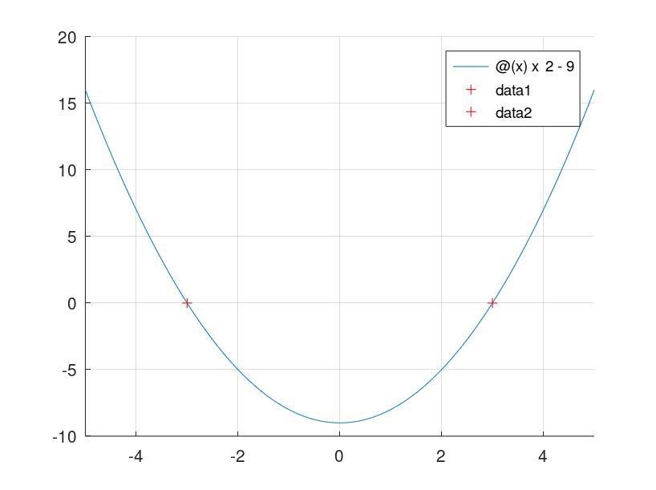

# III. Polynomial

## Exercise 1: Calculate the arithmetic operations below

a) $12^2 - 13^2$

b) 24 *5 / 1.5

c) 7!

d) $4^2 + 3^2 - 124$

e) $\frac{6}{5} * (\frac{1}{2} * \frac{1}{4} - 1)$

```matlab
% (c)2022 Quang Anh.
clc;
clear;
clf;

a = 12^2 - 13^2
b = 24 * 5/1.5
c = factorial(7)
d = 4^2 + 3^2 - 124
e = 6/5 * (1/2 * 1/4 - 1)
```

Output:

```
a = -25
b =  80
c =  5040
d = -99
e = -1.0500
```

## Exercise 2: fzero

Given a quadratic equation

$$
f(x) = x^2 - 9
$$

a) Find the positive root of this polynomial equation using *fzero* in Matlab

```matlab
% (c)2022 Quang Anh.
clc;
clear;
clf;

f = @(x) x^2 - 9;

x0 = -2;
x = fzero(f,x0)

hold on
grid on
fplot(f)
plot(x0, f(x0), 'g+')
plot(x, f(x), 'r+')
hold off
```

Output


b) If we put in an initial guess of zero, it finds the negative or positive root?

```matlab
% (c)2022 Quang Anh.
clc;
clear;
clf;

f = @(x) x^2 - 9;

x0 = 0;
x = fzero(f,x0)

hold on
grid on
fplot(f)
plot(x0, f(x0), 'g+')
plot(x, f(x), 'r+')
hold off
```

Output


c) Use the *optimset* function of fzero to display all the iteration

```matlab
% (c)2022 Quang Anh.
clc;
clear;
clf;

f = @(x) x^2 - 9;

x0 = -2;
options = optimset('Display','iter'); % show iterations
x = fzero(f,x0, options)

hold on
grid on
fplot(f)
plot(x0, f(x0), 'g+')
plot(x, f(x), 'r+')
hold off
```

Output

```
Search for an interval around -2 containing a sign change:
 Func-count    a          f(a)             b          f(b)        Procedure
    1              -2            -5            -2            -5   initial interval
    2              -2            -5         -1.98       -5.0796   search
    3              -2            -5         -2.05       -4.7975   search
    4              -2            -5          -1.9         -5.39   search
    5              -2            -5          -2.2         -4.16   search
    6              -2            -5          -1.5         -6.75   search
    7              -2            -5            -3             0   search

Search for a zero in the interval [-3, -2]:
 Func-count    x          f(x)             Procedure
    7              -3             0        initial

Algorithm converged.

x = -3
```


d) Use the *optimset* function of fzero to set a tolerance: tolx = $10^{-3}$

```matlab
% (c)2022 Quang Anh.
clc;
clear;
clf;

f = @(x) x^2 - 9;

x0 = 0;
options = optimset('Display','iter','TolX',1e-3)
x = fzero(f,x0,options)

hold on
grid on
fplot(f)
plot(x0, f(x0), 'g+')
plot(x, f(x), 'r+')
hold off
```

Output

```
options =

  scalar structure containing the fields:

    Display = iter
    TolX = 1.0000e-03

Search for an interval around 0 containing a sign change:
 Func-count    a          f(a)             b          f(b)        Procedure
    1               0            -9             0            -9   initial interval
    2               0            -9         0.099       -8.9902   search
    3               0            -9        0.1025      -8.98949   search
    4               0            -9         0.095      -8.99098   search
    5               0            -9          0.11       -8.9879   search
    6               0            -9         0.075      -8.99437   search
    7               0            -9          0.15       -8.9775   search
    8               0            -9             0            -9   search
    9               0            -9          0.35       -8.8775   search
   10               0            -9          -0.4         -8.84   search
   11               0            -9           1.1         -7.79   search
   12               0            -9          -4.9         15.01   search

Search for a zero in the interval [-4.9, 0]:
 Func-count    x          f(x)             Procedure
   12               0            -9        initial
   13        -1.83673      -5.62641        interpolation
   14        -3.36837        2.3459        interpolation
   15        -3.19097        1.1823        interpolation
   16        -2.99725    -0.0164972        interpolation
   17        -3.00258     0.0154927        interpolation
   18              -3   3.07975e-07        interpolation
   19        -2.99862   -0.00825034        interpolation

Algorithm converged.

x = -2.9986
```


e) Verify the solution using *roots* in Matlab

```matlab
% (c)2022 Quang Anh.
clc;
clear;
clf;

% f = x^2 - 9;

p = [1 0 -9]; % (f = ax^2 + bx + c)
x = roots(p)

x(1)

f = @(x) x^2 - 9;

hold on
grid on
fplot(f)
plot(x(1), f(x(1)), 'r+')
plot(x(2), f(x(2)), 'r+')
hold off
```

Output

```
x =

  -3
   3

ans = -3
```



# IV. System non linear

## Exercise 1: Newton-Raphson

$$
x_1^2 + x_1x_2 = 10 \newline
x_2 + 3x_1x_2^2 = 57
$$

a) Use the graph to derive good guesses using *ezplot* in Matlab

```matlab
% (c)2022 Quang Anh.
clc;
clear;
clf;

hold on
ezplot('x1^2 + x1*x2 - 10', [0 8])
ezplot('x2 + 3*x1*x2^2 - 57', [0 8])

title('Line Plot of y = x1^2 +x1*x2 - 10 and y = x2 +3*x1*x2^2 - 57');
xlabel('x');
ylabel('y');
legend({'y = x_1^2 +x_1*x_2 - 10','y = x_2 +3*x_1*x_2^2 - 57'},'Location','northeast');
grid on
hold off
```

Output


b) Given a code below, explain the code

```matlab
clc
clear all
close all
%%
	x=[1 1]';
	N = 50;
	for k=1:N,
F=[ x(1)*x(1)+ x(1)*x(2) - 10 ; x(2) + 3*x(1)*x(2)*x(2)-57];
A=[2*x(1)+x(2), x(1) ; 3*x(2).^2 , 1 + 6*x(1).*x(2)];
dx=A\F;
x=x-dx
k=k+1;
end
k
x'
F'
```

Source code

```matlab
% (c)2022 Quang Anh.
clc;
clear;
clf;

clc
clear all
close all
%%
x=[1 1]'; 
N = 50; 
for k=1:N,
    F=[ x(1)*x(1) + x(1)*x(2) - 10 ; x(2) + 3*x(1)*x(2)*x(2) - 57]; 
    J=[2*x(1) + x(2), x(1) ; 3*x(2).^2 , 1 + 6*x(1).*x(2)];
    dx=J\F;
    x=x-dx;
end
k
x 
F1 = F(1)
F2 = F(2)

%-------------
hold on
ezplot('x1^2 +x1*x2 - 10', [0 8])
ezplot('x2 +3*x1*x2^2 - 57', [0 8])
plot(x(1), x(2), 'ro')
title('Line Plot of y = x1^2 +x1*x2 - 10 and y = x2 +3*x1*x2^2 - 57');
xlabel('x');
ylabel('y');
legend({'y = x_1^2 +x_1*x_2 - 10','y = x_2 +3*x_1*x_2^2 - 57'},'Location','northeast');
grid on
hold off
```

Output

```
k = 50
x =

   2
   3

F1 = 0
F2 = 0
```


c) Create and save the function file root2d.m as follows:

```matlab
function F = root2d(x)
F(1) = x(1)^2 + x(1)*x(2) - 10;
F(2) = x(2) + 3*x(1)*x(2)^2 - 57;
```

Now write a separate script file (in the same directory), that will use the function *fsolve* to find the solution of the system with initial guess $x_0 = [0,0]$. Explain the code?

```matlab
% (c)2022 Quang Anh.
clc;
clear;
clf;

x0 = [0,0]
options=optimset('Display','iter');
[x,fval,exitflag,funcCount,jacobian] = fsolve(@root2d,x0,options)

%-------------
hold on
ezplot('x1^2 +x1*x2 - 10', [0 8])
ezplot('x2 +3*x1*x2^2 - 57', [0 8])
plot(x(1), x(2), 'ro')
title('Line Plot of y = x1^2 +x1*x2 - 10 and y = x2 +3*x1*x2^2 - 57');
xlabel('x');
ylabel('y');
legend({'y = x_1^2 +x_1*x_2 - 10','y = x_2 +3*x_1*x_2^2 - 57'},'Location','northeast');
grid on
hold off
```

Output:

```
x0 =

   0   0

warning: matrix singular to machine precision
warning: called from
    fsolve>__dogleg__ at line 548 column 5
    fsolve at line 364 column 11
    2_IV_1c.m at line 9 column 38

x =

   2.0000   3.0000

fval =

  -1.0424e-09   1.8659e-07

exitflag = 1
funcCount =

  scalar structure containing the fields:

    iterations = 7
    successful = 6
    funcCount = 19

jacobian =

    7.0002    2.0000
   27.0033   37.0021

warning: inline is obsolete; use anonymous functions instead
```


d) Use the function newtmult.m to solve the system above, explain the code?

```matlab
% ©2020 HP.
function [x,f,ea,iter]=newtmult(func,x0,es,maxit,varargin) 
    % newtmult: Newton-Raphson root zeroes nonlinear systems
    % [x,f,ea,iter]=newtmult(func,x0,es,maxit,p1,p2,...):
    % uses the Newton-Raphson method to find the roots of
    % a system of nonlinear equations
    % input:
    % func = name of function that returns f and J
    % x0 = initial guess
    % es = desired percent relative error (default = 0.0001%)
    % maxit = maximum allowable iterations (default = 50)
    % p1,p2,... = additional parameters used by function
    % output:
    % x = vector of roots
    % f = vector of functions evaluated at roots
    % ea = approximate percent relative error (%)
    % iter = number of iterations
    if nargin<2
        error('at least 2 input arguments required')
    end
        
    if nargin<3||isempty(es)
        es=0.0001;
    end
    if nargin<4||isempty(maxit)
        maxit=50;
    end
    iter = 0;
    x=x0;
    while (1)
        [J,f]=func(x,varargin{:});
        dx=J\f;
        x=x-dx;
        iter = iter + 1;
        ea=100*max(abs(dx./x));
        if iter>=maxit||ea<=es
            break
        end
    end
    disp(f)
end
```

```matlab
% (c)2022 Quang Anh.
clc;
clear;
clf;

x0 = [1.5 3.5]';
es = 0.05;
maxit = 5000;
[x,f,ea,iter]=newtmult(@root2,x0,es,maxit)
fprintf('- x = %f\n', x);
fprintf('- f = %f\n', f);
fprintf('- approximate relative error (%%) = %f\n', ea);
fprintf('- number of iterations = %d\n', iter);

%-------------
hold on
ezplot('x1^2 +x1*x2 - 10', [0 8])
ezplot('x2 +3*x1*x2^2 - 57', [0 8])
plot(x(1), x(2), 'ro')
title('Line Plot of y = x_1^2 +x_1*x_2 - 10 and y = x_2 +3*x_1*x_2^2 - 57');
xlabel('x');
ylabel('y');
legend({'y = x_1^2 +x_1*x_2 - 10','y = x_2 +3*x_1*x_2^2 - 57'},'Location','northeast');
grid on
hold off
```

```matlab
% (c)2021 HP.
function [J, F] = root2(x)
    F=[ x(1)*x(1) + x(1)*x(2) - 10 ; x(2) + 3*x(1)*x(2)*x(2)-57]; 
    J=[2*x(1) + x(2), x(1); 3*x(2).^2, 1 + 6*x(1).*x(2)];
end
```

Output:

```
-1.2861e-06
  -2.2140e-05
x =

   2.0000
   3.0000

f =

  -1.2861e-06
  -2.2140e-05

ea = 1.9554e-05
iter = 4
- x = 2.000000
- x = 3.000000
- f = -0.000001
- f = -0.000022
- approximate relative error (%) = 0.000020
- number of iterations = 4
```


# V. Common

## Exercise 1: Calculate the value of x

a) $log(x) = 770$

```matlab
% (c)2022 Quang Anh.
clc;
clear;
clf;

f = @(x) log(x) - 1;

x0 = 1;
x = fzero(f,x0)
y = f(x)

hold on
ezplot(f)
plot(x, y, 'r+')

grid on
hold off

x1 = e^1
% e^(log(x)) = x = e^1
```

Output

```
x = 2.7183
y = 0
x1 = 2.7183
```

.jpg)

b) $e^x = 15$

```matlab
% (c)2022 Quang Anh.
clc;
clear;
clf;

f = @(x) e.^x - 15;

x0 = 1;
x = fzero(f,x0)
y = f(x)

hold on
ezplot(f)
plot(x, y, 'r+')

grid on
hold off
% log(e.^x) = x = log(15)
```

Output:

```
x = 2.7081
y = 2.4869e-14
```


c) $sin(x) = 0.12$ (In radian)

```matlab
% (c)2022 Quang Anh.
clc;
clear;
clf;

f = @(x) sin(x) - 0.12; %angle is in radian

x0 = [-pi/2 pi/2];
x = fzero(f,x0)
%x = fsolve(f,x0)
y = f(x)

hold on
ezplot(f)
plot(x, y, 'r+')

grid on
hold off
```

Output:

```
x = 0.1203
y = 0
```

.jpg)

d) $sin(x + \frac{\pi}{5}) = 0.25$ (In radian)

```matlab
% (c)2022 Quang Anh.
clc;
clear;
clf;

f = @(x) sin(x + pi/5) - 0.25; %angle is in radian

x0 = 2;
x = fzero(f,x0)
%x = fsolve(f,x0)
y = f(x)

hold on
ezplot(f)
plot(x, y, 'r+')

grid on
hold off
```

Output:

```
x = 2.2606
y = 1.5543e-15
```

.jpg)

e) $tan(x + \frac{2\pi}{3}) = 3$ (In radian)

```matlab
% (c)2022 Quang Anh.
clc;
clear;
clf;

f = @(x) tan(x + 2*pi/3) - 3; %angle is in radian

x0 = [2 3];
x = fsolve(f,x0)
%x = fzero(f,x0)
y = f(x)

hold on
ezplot(f)
plot(x, y, 'r+')

grid on
hold off
```

Output:

```
x =

   2.2962   5.4378

y =

   3.9711e-06  -2.2204e-15
```


## Exercise 2: Create a vector x that:

- is a row vector
- has 5 elements respectively: 2, 3, 1, 5, 11.

a) Find the length and the size of x, how are they different?

b) Find the transpose of x?

c) Calculate the product of x and its transpose.

```matlab
% (c)2022 Quang Anh.
clc;
clear;
clf;

x = [2 3 1 5 11]

length(x)

xT = x'

x*xT
```

Output

```
x =

    2    3    1    5   11

ans = 5
xT =

    2
    3
    1
    5
   11

ans = 160
```