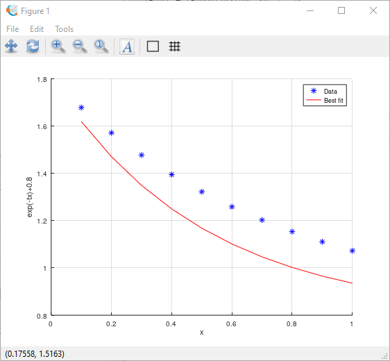

# I. Curve Fitting

## Exercise 1

The table below gives the weight and the **JHI** number (**Jonash Health Indicator)** of each student in a class. Use it to predict the **JHI** number of Van Lam whose weight is 72kg.

| Student | Weight (kg) | JHI |
| --- | --- | --- |
| Lan Anh | 40 | 1450 |
| Van Toan | 63 | 3817 |
| Quang Hai | 62 | 3708 |
| Xuan Truong | 68 | 4300 |
| Cong Phuong | 64 | 3950 |
| Huyen My | 45 | 1896 |
| My Linh | 50 | 2339 |
| Duc Chinh | 66 | 4200 |
| Phan Van Duc | 67 | 4312 |
1. Use function “fit()” in matlab. Plot results

***Warning:** fit undefined in Octave and MATLAB.*

```matlab
clc;
clear;
clf;

students = {"Lan Anh", "Van Toan", "Quang Hai", "Xuan Truong", "Cong Phuong", "Huyen My", "My Linh", "Duc Chinh", "Phan Van Duc"};
weight = [40 63 62 68 64 45 50 66 67];
JHI = [1450 3817 3708 4300 3950 1896 2339 4200 4312];
VanLam = 72;

f = fit(weight', JHI', 'poly1') % Only available in MATLAB
```

Output:

```
f = 

     Linear model Poly1:
     f(x) = p1*x + p2
     Coefficients (with 95% confidence bounds):
       p1 =       106.6  (101.7, 111.5)
       p2 =       -2887  (-3178, -2596)
```

1. Use the function “polyfit()” in matlab. Plot results

```matlab
% (c)2021 Hien PHAN.
clc;
clear;
clf;

Student = {"Lan Anh", "Van Toan", "Quang Hai", "Xuan Truong", "Cong Phuong", "Huyen My", "My Linh", "Duc Chinh", "Phan Van Duc"}
Weight = [40 63 62 68 64 45 50 66 67]
JHI = [1450 3817 3708 4300 3950 1896 2339 4200 4312]
VanLam = 72

%f = polyfit(Weight, JHI, 2)
%func = @(x) f(1)*x^2 + f(2)*x + f(3)

f = polyfit(Weight, JHI, 1)
func1 = @(x) f(1)*x + f(2)

figure(1)
hold on
grid on
fplot(func1, [20 80]);
plot(Weight, JHI, 'b*');
plot(VanLam, func1(VanLam), '+');
fprintf('Predicted JHI number of Van Lam: %f\n', func1(VanLam));
hold off

%--------------

f = polyfit(Weight, JHI, 2)
func2 = @(x) f(1)*x^2 + f(2)*x + f(3)

figure(2)
hold on
grid on
fplot(func2, [20 80]);
plot(Weight, JHI, 'b*');
plot(VanLam, func2(VanLam), '+');
fprintf('Predicted JHI number of Van Lam: %f\n', func2(VanLam));
hold off
```

Output:

```
Student =
{
  [1,1] = Lan Anh
  [1,2] = Van Toan
  [1,3] = Quang Hai
  [1,4] = Xuan Truong
  [1,5] = Cong Phuong
  [1,6] = Huyen My
  [1,7] = My Linh
  [1,8] = Duc Chinh
  [1,9] = Phan Van Duc
}

Weight =

   40   63   62   68   64   45   50   66   67

JHI =

   1450   3817   3708   4300   3950   1896   2339   4200   4312

VanLam = 72
f =

    106.58  -2886.75

func1 =

@(x) f (1) * x + f (2)

Predicted JHI number of Van Lam: 4786.770311
f =

   5.5396e-01   4.6221e+01  -1.3051e+03

func2 =

@(x) f (1) * x ^ 2 + f (2) * x + f (3)

Predicted JHI number of Van Lam: 4894.601600
```


1. Use the function “lsqcurvefit()” in matlab. Plot results

```matlab
% (c)2021 Hien PHAN.
clc;
clear;
clf;

Student = {"Lan Anh", "Van Toan", "Quang Hai", "Xuan Truong", "Cong Phuong", "Huyen My", "My Linh", "Duc Chinh", "Phan Van Duc"}
Weight = [40 63 62 68 64 45 50 66 67]
JHI = [1450 3817 3708 4300 3950 1896 2339 4200 4312]
VanLam = 72

c1 =  @(f, x) f(1)*x + f(2);

pkg load optim
a1 = lsqcurvefit(c1, [2;3], Weight, JHI)

func1 = @(x) a1(1)*x+a1(2)
figure(1)
hold on
grid on
plot(Weight, JHI, 'b*');
fplot(func1, [20 80]);
plot(VanLam, func1(VanLam), 'r+');
fprintf('Predicted JHI number of Van Lam: %f', func1(VanLam));
hold off

% second order

c2 = @(f,x) f(1)*x.^2+f(2)*x+f(3)

pkg load optim
a2 = lsqcurvefit(c2, [2;3;4], Weight, JHI)

func2 = @(x) a2(1)*x.^2+a2(2)*x+a2(3)

figure(2)
hold on
grid on
plot(Weight, JHI, 'b*');
fplot(func2, [20 80]);
plot(VanLam, func2(VanLam), 'r+');
fprintf('Predicted JHI number of Van Lam: %f', func2(VanLam));
hold off
```

Output:

```
Student =
{
  [1,1] = Lan Anh
  [1,2] = Van Toan
  [1,3] = Quang Hai
  [1,4] = Xuan Truong
  [1,5] = Cong Phuong
  [1,6] = Huyen My
  [1,7] = My Linh
  [1,8] = Duc Chinh
  [1,9] = Phan Van Duc
}

Weight =

   40   63   62   68   64   45   50   66   67

JHI =

   1450   3817   3708   4300   3950   1896   2339   4200   4312

VanLam = 72
a1 =

    106.58
  -2886.75

func1 =

@(x) a1 (1) * x + a1 (2)

Predicted JHI number of Van Lam: 4786.770305c2 =

@(f, x) f (1) * x .^ 2 + f (2) * x + f (3)

a2 =

   5.5396e-01
   4.6221e+01
  -1.3051e+03

func2 =

@(x) a2 (1) * x .^ 2 + a2 (2) * x + a2 (3)

Predicted JHI number of Van Lam: 4894.601623
```


## Exercise 2

Given the decaying equation of a **Kagawa**’s particle: **y = exp(-t.x)+0.8** and a recorded table of observation:

| x | y |
| --- | --- |
| 0.1 | 1.6781 |
| 0.2 | 1.5711 |
| 0.3 | 1.4771 |
| 0.4 | 1.3945 |
| 0.5 | 1.3220 |
| 0.6 | 1.2584 |
| 0.7 | 1.2025 |
| 0.8 | 1.1535 |
| 0.9 | 1.1104 |
| 1.0 | 1.0725 |
1. Find the decaying rate **t** by function “lsqnonlin()” in matlab. Plot results

```matlab
% ©2020 HP.
clc;
clear;
clf;

x = [0.1 0.2 0.3 0.4 0.5 0.6 0.7 0.8 0.9 1.0]
%x = linspace(0.1, 1, 10)
y = [1.6781 1.5711 1.4771 1.3945 1.3220 1.2584 1.2025 1.1535 1.1104 1.0725]
func = @(t) exp(-t*x)+0.8-y
x0 = 3;

pkg load optim
t = lsqnonlin(func,x0)

hold on
grid on
plot(x, y, 'b*');
plot( x, exp(-t*x)+0.8,'r-');
hold off
legend('Data','Best fit')
xlabel('x')
ylabel('exp(-tx)+0.8')
```

Output:

```
x =

   0.1000   0.2000   0.3000   0.4000   0.5000   0.6000   0.7000   0.8000   0.9000   1.0000

y =

   1.6781   1.5711   1.4771   1.3945   1.3220   1.2584   1.2025   1.1535   1.1104   1.0725

func =

@(t) exp (-t * x) + 0.8 - y

t = 1.3000
```


b. Try to use lb, ub, options in: x = lsqnonlin(fun,x0,lb,ub,options)

```matlab
% ©2020 HP.
clc;
clear;
clf;

x = [0.1 0.2 0.3 0.4 0.5 0.6 0.7 0.8 0.9 1.0];
%x = linspace(0.1, 1, 10)
y = [1.6781 1.5711 1.4771 1.3945 1.3220 1.2584 1.2025 1.1535 1.1104 1.0725];

func = @(t) exp(-t*x)+0.8-y
x0 = 3;

pkg load optim
t = lsqnonlin(func,x0, 2, 3)

hold on
grid on
plot(x, y, 'b*');
plot( x, exp(-t*x)+0.8,'r-');
hold off
legend('Data','Best fit')
xlabel('x')
ylabel('exp(-tx)+0.8')
```

Output:

```
func =

@(t) exp (-t * x) + 0.8 - y

t = 2
ans = -25.000
```



## Exercise 3

Given a table of observation:

| x | f(x) |
| --- | --- |
| 0.00000 | 0.00000 |
| 0.78540 | 0.70711 |
| 1.57080 | 1.00000 |
| 2.35619 | 0.70711 |
| 3.14159 | 0.00000 |
| 3.92699 | -0.70711 |
| 4.71239 | -1.00000 |
| 5.49779 | -0.70711 |
| 6.28319 | 0.00000 |
1. Calculate f(3.00000) and f(4.50000) by function “interp1()” in matlab. Plot results.

```matlab
% ©2021 HP.
clc;
clear;
clf;

x = [0.00000 0.78540  1.57080 2.35619 3.14159  3.92699  4.71239  5.49779  6.28319]
y = [0.00000 0.70711 1.00000 0.70711  0.00000  -0.70711  -1.00000  -0.70711  0.00000]

%pkg load optim

x1 = 3
x2 = 4.5

method = 'nearest'
% method = 'cubic'
% method = 'spline'

%y1 = interp1(x, y, x1)
%y2 = interp1(x, y, x2)

y1 = interp1(x, y, x1, method)
y2 = interp1(x, y, x2, method)
plot(x, y, 'b*',x, y, 'r-', x1, y1, 'r+', x2, y2, 'g+')
```

Output:

```
x =

 Columns 1 through 8:

        0   0.7854   1.5708   2.3562   3.1416   3.9270   4.7124   5.4978

 Column 9:

   6.2832

y =

 Columns 1 through 8:

        0   0.7071   1.0000   0.7071        0  -0.7071  -1.0000  -0.7071

 Column 9:

        0

x1 = 3
x2 = 4.5000
method = nearest
y1 = 0
y2 = -1
```


b. Try to use another method (‘nearest', 'cubic', or 'spline'.) with vq = interp1(x,v,xq,method)

### cubic

```matlab
% ©2021 HP.
clc;
clear;
clf;

x = [0.00000 0.78540  1.57080 2.35619 3.14159  3.92699  4.71239  5.49779  6.28319]
y = [0.00000 0.70711 1.00000 0.70711  0.00000  -0.70711  -1.00000  -0.70711  0.00000]

%pkg load optim

x1 = 3
x2 = 4.5

% method = 'nearest'
method = 'cubic'
% method = 'spline'

%y1 = interp1(x, y, x1)
%y2 = interp1(x, y, x2)

y1 = interp1(x, y, x1, method)
y2 = interp1(x, y, x2, method)
plot(x, y, 'b*',x, y, 'r-', x1, y1, 'r+', x2, y2, 'g+')
```

Output:

```
x =

 Columns 1 through 8:

        0   0.7854   1.5708   2.3562   3.1416   3.9270   4.7124   5.4978

 Column 9:

   6.2832

y =

 Columns 1 through 8:

        0   0.7071   1.0000   0.7071        0  -0.7071  -1.0000  -0.7071

 Column 9:

        0

x1 = 3
x2 = 4.5000
method = cubic
y1 = 0.1353
y2 = -0.9694
```

### spline

```matlab
% ©2021 HP.
clc;
clear;
clf;

x = [0.00000 0.78540  1.57080 2.35619 3.14159  3.92699  4.71239  5.49779  6.28319]
y = [0.00000 0.70711 1.00000 0.70711  0.00000  -0.70711  -1.00000  -0.70711  0.00000]

%pkg load optim

x1 = 3
x2 = 4.5

% method = 'nearest'
% method = 'cubic'
method = 'spline'

%y1 = interp1(x, y, x1)
%y2 = interp1(x, y, x2)

y1 = interp1(x, y, x1, method)
y2 = interp1(x, y, x2, method)
plot(x, y, 'b*',x, y, 'r-', x1, y1, 'r+', x2, y2, 'g+')
```

Output:

```
x =

 Columns 1 through 8:

        0   0.7854   1.5708   2.3562   3.1416   3.9270   4.7124   5.4978

 Column 9:

   6.2832

y =

 Columns 1 through 8:

        0   0.7071   1.0000   0.7071        0  -0.7071  -1.0000  -0.7071

 Column 9:

        0

x1 = 3
x2 = 4.5000
method = spline
y1 = 0.1407
y2 = -0.9774
```

## Exercise 4

Given x runs from -3 to 3 with step of 1 and does y.

1. Draw a grid of coordinates of (x,y) (hint: meshgrid)
2. Build a random function z having many local extremes that takes only 2 arguments x and y. (hint: peaks)
3. Compute **z(1.2, 2.8)** and **z(2.5, 2.5)** by function “interp2()”

```matlab
% ©2020 HP.
clc;
clear;
clf;
pkg load optim
fprintf('\n--------------------------------------\n')
fprintf('Labwork 4: V. CURVE FITTING PROBLEMS\n');
fprintf('EXERCISE 4\n');
fprintf('--------------------------------------\n\n')
x = -3:1:3
y = -3:1:3
meshgrid(x,y)
z = peaks(x,y)
fprintf('--------------------------------------\n\n')
xi = 1.2
yi = 2.8
zi = interp2(x, y, z, xi, yi)
figure
surf(x,y,z)
title('xi = 1.2; yi = 2.8');
fprintf('--------------------------------------\n\n')
xi = 2.5
yi = 2.5
zi = interp2(x, y, z, xi, yi)
figure
surf(x,y,z)
title('xi = 2.5; yi = 2.5');
```

Output:

```
--------------------------------------
Labwork 4: V. CURVE FITTING PROBLEMS
EXERCISE 4
--------------------------------------

x =

  -3  -2  -1   0   1   2   3

y =

  -3  -2  -1   0   1   2   3

ans =

  -3  -2  -1   0   1   2   3
  -3  -2  -1   0   1   2   3
  -3  -2  -1   0   1   2   3
  -3  -2  -1   0   1   2   3
  -3  -2  -1   0   1   2   3
  -3  -2  -1   0   1   2   3
  -3  -2  -1   0   1   2   3

z =

 Columns 1 through 6:

   6.6713e-05   3.3780e-03  -2.9871e-02  -2.4495e-01  -1.0996e-01  -4.3144e-03
   7.4734e-04   4.6835e-02  -5.9213e-01  -4.7596e+00  -2.1024e+00  -6.1640e-02
  -8.7619e-03  -1.3005e-01   1.8559e+00  -7.2391e-01  -2.7292e-01   4.9964e-01
  -3.6506e-02  -1.3327e+00  -1.6523e+00   9.8101e-01   2.9369e+00   1.4122e+00
  -1.3669e-02  -4.8076e-01   2.2890e-01   3.6886e+00   2.4338e+00   5.8045e-01
   1.5489e-05   7.9668e-02   2.0967e+00   5.8591e+00   2.2099e+00   1.3285e-01
   3.2235e-05   5.3057e-03   1.0992e-01   2.9987e-01   1.1068e-01   5.6644e-03

 Column 7:

  -5.8642e-06
   4.1822e-04
   1.3012e-02
   3.3125e-02
   1.2467e-02
   1.3202e-03
   4.1030e-05

--------------------------------------

xi = 1.2000
yi = 2.8000
zi = 0.4306

--------------------------------------

xi = 2.5000
yi = 2.5000
zi = 0.034969
```


# II. Common

## Exercise 1

Find the eigenvalues and eigenvectors of the following matrix

$$
A = \begin{pmatrix}
2 & 1 \\
1 & 2 \\
\end{pmatrix}
$$

```matlab
A = [2 1; 1 2];
eig(A)
```

Output is 1 and 3

## Exercise 2

| T⁍ | 5 | 20 | 30 | 50 | 55 |
| --- | --- | --- | --- | --- | --- |
| ⁍ | 0.08 | 0.015 | 0.009 | 0.006 | 0.0055 |

Try to use:

```matlab
x = [5 20 30 50 55];
y = [0.08 0.015 0.009 0.006 0.0055]
figure
box on
hold on
plot(x,y,'*')
plot(x,y,'o')
plot(x,y,'.')
```

Output:

.png)

# III. Linear regression

The following table gives the metabolism rate as a function of mass in some animals. Use it to predict the metabolism rate of a 350 - kg tiger

| Animal | Mass (kg) | Metabolism (watts) |
| --- | --- | --- |
| Cow | 400 | 270 |
| Human | 70 | 82 |
| Sheep | 45 | 50 |
| Hen | 2 | 4.8 |
| Rat | 0.3 | 1.45 |
| Dove | 0.16 | 0.97 |

Do the regression by 2 methods:

a) Write a script file which employs the following function file:

```matlab
% ©2020 HP.
function [ a0,a1,r2 ] = linear_regression( x, y )
    %UNTITLED2 Summary of this function goes here
    % Detailed explanation goes here
    % Linear regression: y = a0 + a1.x
    % x: independent variable
    % y: dependent variable
    % r2: coefficient of determination
    if length(x)~=length(y)
        fprintf('The independent and the dependent variables should have same number of elements');
    else
        n=length(x) % The number of data
    end
    X=mean(x); Y=mean(y);
    a1=(x*y'/n-X*Y)/var(x);
    a0=Y-a1*X;
    r2= (n*x*y'-n*X*n*Y)/sqrt((n*x*x'-(n*X)^2)*(n*y*y'-(n*Y)^2));
    % Create the best fit line
    space = (min(x) + max(x))/20;
    xp=linspace(min(x)-space,max(x)+space);
    yp=a0+a1*xp;
    plot(x,y,'b.',xp,yp,'r-');
end
```

b) Use the **Curve fitting Apps** in MATLAB. Is there any difference in the two regression results?

c) Use the functions polyfit in MATLAB to fit the points by a polynomial with degree n and polyval to estimate the metabolism rate of the tiger. From what degree of the polynomial the estimated result becomes badly conditioned? And from what degree of the polynomial the fitting curve is no longer unique?

d) Do the tasks cited in c) by using the **Curve fitting Apps.**

```matlab
% ©2020 HP.
clc;
clear;
clf;
pkg load optim
fprintf('\n--------------------------------------\n')
fprintf('Labwork 4b: Linear regression\n');
fprintf('EXERCISE 1\n');
fprintf('--------------------------------------\n\n')

Mass = [400 70 45 2 0.3 0.16]
Metabolism = [270 82 50 4.8 1.45 0.97]
choice = "a"
if choice == "a"
    hold on
    grid on
    [ a0,a1,r2 ] = linear_regression( Mass, Metabolism )
    xi = [120 260 350]
    y = a0 + a1*xi
    plot(xi, y, 'r+')
    hold off
elseif choice == "c1"
    f = polyfit(Mass, Metabolism, 1)
    func = @(x) f(1)*x + f(2)
    p = [f(1) f(2)]
    xi = [120 260 350] 
    y = polyval(p, xi)
    hold on
    grid on
    fplot(func, [0, 450]);
    plot(Mass, Metabolism, 'g.');
    plot(xi, y, 'r+')
    hold off
elseif choice == "c2"
    f = polyfit(Mass, Metabolism, 2)
    func = @(x) f(1)*x^2 + f(2)*x +f(3)
    p = [f(1) f(2) f(3)]
    xi = [120 260  350] 
    y = polyval(p, xi)
    hold on
    grid on
    fplot(func, [0, 450]);
    plot(Mass, Metabolism, 'g.');
    plot(xi, y, 'r+')
    hold off
end
```

Output:

```
--------------------------------------
Labwork 4b: Linear regression
EXERCISE 1
--------------------------------------

Mass =

   400.0000    70.0000    45.0000     2.0000     0.3000     0.1600

Metabolism =

   270.0000    82.0000    50.0000     4.8000     1.4500     0.9700

choice = a
n = 6
a0 = 20.776
a1 = 0.5499
r2 = 0.9909
xi =

   120   260   350

y =

    86.767   163.756   213.249
```


If I choice c1, the output is:

```
--------------------------------------
Labwork 4b: Linear regression
EXERCISE 1
--------------------------------------

Mass =

   400.0000    70.0000    45.0000     2.0000     0.3000     0.1600

Metabolism =

   270.0000    82.0000    50.0000     4.8000     1.4500     0.9700

choice = c1
f =

    0.6599   11.2908

func =

@(x) f (1) * x + f (2)

p =

    0.6599   11.2908

xi =

   120   260   350

y =

    90.480   182.867   242.258
```


Else if I choice c2, the output is:

```
--------------------------------------
Labwork 4b: Linear regression
EXERCISE 1
--------------------------------------

Mass =

   400.0000    70.0000    45.0000     2.0000     0.3000     0.1600

Metabolism =

   270.0000    82.0000    50.0000     4.8000     1.4500     0.9700

choice = c2
f =

  -1.3719e-03   1.2212e+00   1.0518e+00

func =

@(x) f (1) * x ^ 2 + f (2) * x + f (3)

p =

  -1.3719e-03   1.2212e+00   1.0518e+00

xi =

   120   260   350

y =

   127.84   225.82   260.41

warning: fplot: FN is not a vectorized function which reduces performance
warning: called from
    fplot at line 175 column 5
    Labwork_4b_1 at line 42 column 5
```


# IV. Nonlinear regression

One of the equations approximating the relation between the pressure and the volume of a real gas is as follows:

$$
\frac{PV}{RT} = 1 + \frac{A_1}{V} + \frac{A_2}{V^2}
$$

The pressure and the volume of the gas are measured and the results are shown in the following table:

| P(atm) | 0.985 | 1.108 | 1.363 | 1.631 |
| --- | --- | --- | --- | --- |
| V(mL) | 25000 | 22200 | 18000 | 15000 |

Knowing that R=82.05 mL.atm/gmol.K and T=303K, use the function fminsearch to write a script file using the following function file to find $A_1$ and $A_2$

```matlab
% ©2020 HP.
function f = PVSSR( a, x, y )
    %UNTITLED4 Summary of this function goes here
    % Detailed explanation goes here
    if length(x)==length(y)
        n=length(x);
    else
        fprintf('The two data must have the same length');
    end
    yp=zeros(1,n);
    for j=1:n
        yp(j)=82.05*303*(1+a(1)/x(j)+a(2)/x(j)^2)/x(j);
    end
    f=(y-yp)*(y-yp)';
end
```

Explain: what is the meaning of a, x, y and f?

Use the function `fminbnd` to find the minimum value of the pressure if the volume varies between 2000 mL to 4000 mL

```matlab
% ©2020 HP.
clc;
clear;
clf;
pkg load optim
fprintf('\n--------------------------------------\n')
fprintf('Labwork 4b: Non-linear regression\n');
fprintf('\n--------------------------------------\n\n')
P = [0.985 1.108 1.363 1.631]
V = [25000 22200 18000 15000]
R = 82.05
T = 303
x = V;
y = P;
f = @(a) PVSSR(a, x, y)
options = optimset('Display', 'iter');
a = fminsearch(f, [10 10], options)
f(a)
hold on
grid on
yp=R*T*(1+a(1)./x+a(2)./x.^2)./x;
plot(x, yp, 'b.')
hold off
```

Output:

```
--------------------------------------
Labwork 4b: Non-linear regression

--------------------------------------

P =

   0.9850   1.1080   1.3630   1.6310

V =

   25000   22200   18000   15000

R = 82.050
T = 303
f =

@(a) PVSSR (a, x, y)

f(x0) = 1.3660e-03
Iter.  1,  how = initial  , nf =   3,  f = 1.3660e-03  (0.0%)
Iter.  2,  how = expand,    nf =   5,  f = 1.2012e-03  (12.1%)
Iter.  3,  how = expand,    nf =   7,  f = 1.0716e-03  (10.8%)
Iter.  4,  how = expand,    nf =   9,  f = 7.3833e-04  (31.1%)
Iter.  5,  how = expand,    nf =  11,  f = 4.2214e-04  (42.8%)
Iter.  6,  how = expand,    nf =  13,  f = 3.7310e-05  (91.2%)
Iter.  7,  how = reflect,   nf =  15,  f = 3.1043e-07  (99.2%)
Iter.  8,  how = contract,  nf =  17,  f = 3.1043e-07  (0.0%)
Iter.  9,  how = contract,  nf =  19,  f = 3.1043e-07  (0.0%)
Iter. 10,  how = shrink,    nf =  23,  f = 2.3193e-07  (25.3%)
Iter. 11,  how = shrink,    nf =  27,  f = 4.0204e-08  (82.7%)
Iter. 12,  how = shrink,    nf =  31,  f = 4.0204e-08  (0.0%)
Iter. 13,  how = shrink,    nf =  35,  f = 4.0204e-08  (0.0%)
Iter. 14,  how = shrink,    nf =  39,  f = 3.8907e-08  (3.2%)
Iter. 15,  how = shrink,    nf =  43,  f = 3.8653e-08  (0.7%)
Iter. 16,  how = shrink,    nf =  47,  f = 3.8554e-08  (0.3%)
Iter. 17,  how = shrink,    nf =  51,  f = 3.8547e-08  (0.0%)
Iter. 18,  how = shrink,    nf =  55,  f = 3.8536e-08  (0.0%)
Iter. 19,  how = shrink,    nf =  59,  f = 3.8536e-08  (0.0%)
Iter. 20,  how = shrink,    nf =  63,  f = 3.8536e-08  (0.0%)
Iter. 21,  how = shrink,    nf =  67,  f = 3.8536e-08  (0.0%)
Algorithm converged.  Simplex size 4.6617e-05 <= 1.0000e-04 and step in function value 1.8518e-12 <= 1.0000e-04
a =

  -237.914   -16.685

ans = 3.8536e-08
```


# V. Descriptive statistics in MATLAB

## a. Statistical functions in MATLAB

Given a set of data s under form of a vector, the functions used to find the characteristics of this set of data in MATLAB are: `mean (s), median(s), mode(s), min(s), max(s), var(s), std(s)`

MATLAB is also able to generate a historgram from a set of data. The function that is utilized is `hist`. The formula for `hist` is: `[n,x] = hist(s)`

Where n = the number of elements in each bin, x = a vector which elements are midpoints of each bin, s = the analyzed vector

The table below shows the height (in cm) of 30 students:

| 176 | 183 | 152 | 164 | 159 | 154 |
| --- | --- | --- | --- | --- | --- |
| 167 | 168 | 156 | 155 | 153 | 190 |
| 182 | 178 | 159 | 161 | 166 | 172 |
| 174 | 175 | 168 | 185 | 184 | 159 |
| 164 | 162 | 164 | 175 | 170 | 169 |

Find:

1. the average height of the 30 students,
2. the variance
3. the standard deviation of the distribution
4. the lowest
5. the highest heights of the student in this class
6. the mode and (g) the median height

Draw a histogram of the height of the students by dividing the students into 5 groups.

```matlab
clc;
clear;
clf;

height = [176 167 182 174 164 183 152 164 168 156 155 178 159 161 175 168 185 162 164 175 159 154 153 190 166 172 184 159 170 169]

% a) Average
a = mean(height)

% b) The variance
b = var(height)

% c) The standard deviation of the distribution
c = std(height)

% d) The lowest
d = min(height)

% e) The highest heights of the student in this class
e = max(height)

% f) the mode
f = mode(height)

% g) the median height
g = median(height)

hist(height)
```

Output:

```
height =

 Columns 1 through 10:

   176   167   182   174   164   183   152   164   168   156

 Columns 11 through 20:

   155   178   159   161   175   168   185   162   164   175

 Columns 21 through 30:

   159   154   153   190   166   172   184   159   170   169

a = 168.13
b = 108.26
c = 10.405
d = 152
e = 190
f = 159
g = 167.50
```


## b. Uniform distribution and normal distribution in MATLAB

In MATLAB, the functions `rand` and `randn` are used to generate the uniform distribution, respectively

Using the functions `rand` and `randn`, establish a 100 - elements row vector. A whose elements are randomly and uniformly distributed between 140 and 180 and a 200 - elements column vector B whose elements are randomly and normally distributed with mean 170 and standard deviation 30.

Find the average, the variance, the standard deviation, the median and the mode among the elements in A and B.

```matlab
clc;
clear;
clf;

a = 140
b = 180

A1 = a + (b-a).*rand(1, 100);
A2 = a + (b-a).*randn(1, 100);

a1 = mean(A1)
a2 = mean(A2)

b1 = var(A1)
b2 = var(A2)

c1 = std(A1)
c2 = std(A2)

mean = 170
std = 30

B = std.*randn(1, 200) + mean
```

Output:

```
a = 140
b = 180
a1 = 158.74
a2 = 136.59
b1 = 132.81
b2 = 1674.6
c1 = 11.524
c2 = 40.922
mean = 170
std = 30
B =

 Columns 1 through 8:

   138.30   130.85   225.45   186.92   221.73   166.84   182.94   165.00

 Columns 9 through 16:

   166.41   229.91   187.44   215.23   165.72   177.32   222.47   159.64

 Columns 17 through 24:

   162.23   154.67   150.03   206.80   164.03   150.04   168.19   203.81

 Columns 25 through 32:

   208.29   160.22   171.96   168.65   160.95   189.84   183.19   211.40

 Columns 33 through 40:

   191.04   222.10   164.72   176.05   158.64   184.95   161.94   218.36

 Columns 41 through 48:

   175.22   168.06   129.03   165.86   177.99   116.82   144.05   165.04

 Columns 49 through 56:

   131.56   128.41   160.29   194.87   173.47   158.79   168.77   164.09

 Columns 57 through 64:

   133.77   189.63   153.90   147.86   112.32   197.63   160.47   190.48

 Columns 65 through 72:

   201.76   206.50   143.21   146.39   168.57   138.01   189.29   141.69

 Columns 73 through 80:

   160.64   127.99   186.07   148.56   222.50   172.54   200.95   146.19

 Columns 81 through 88:

   193.90   189.14   183.23   189.97   186.96   153.77   128.79   140.92

 Columns 89 through 96:

   142.16   193.77   114.47   116.10   189.32   176.66   161.16   152.55

 Columns 97 through 104:

   146.90   163.24   188.09   210.71   178.69   169.42   109.00   170.02

 Columns 105 through 112:

   182.52   225.27   185.11   171.24   147.42   140.38   213.18   216.83

 Columns 113 through 120:

   182.67   137.73   155.57   162.88   150.24   210.42   207.40   179.53

 Columns 121 through 128:

   133.95   152.94   137.12   158.59   149.76   191.72   119.75   119.62

 Columns 129 through 136:

   124.22   144.38   179.70   171.58   199.62   121.16   236.64   111.63

 Columns 137 through 144:

   163.44   185.27   177.54   183.73   176.49   131.20   180.17   231.06

 Columns 145 through 152:

   145.30   211.16   164.75   206.04   126.33   164.47   224.76   171.23

 Columns 153 through 160:

   159.50   191.63   194.72   163.04   217.05   193.11   155.62   201.07

 Columns 161 through 168:

   183.43   211.41   136.87   195.32   190.68   140.58   160.36   149.14

 Columns 169 through 176:

   116.73   181.71   165.02   143.49   136.67   174.55   171.41   185.58

 Columns 177 through 184:

   153.60   198.77   119.60   131.94   189.91   142.18   163.44   174.82

 Columns 185 through 192:

   162.49   217.51   152.68   186.49   168.16   171.17   133.74   126.95

 Columns 193 through 200:

   159.11   124.82   235.60   194.03   177.75   228.89   148.42   141.10
```