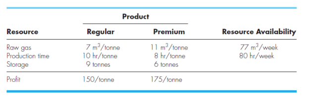
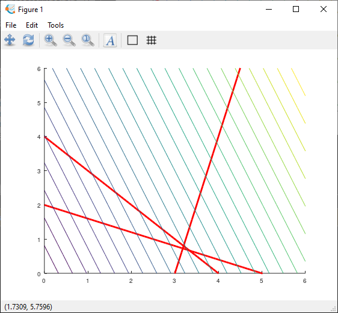
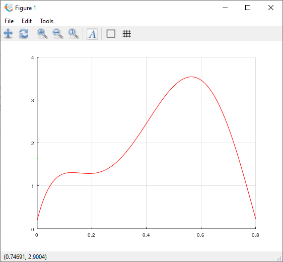
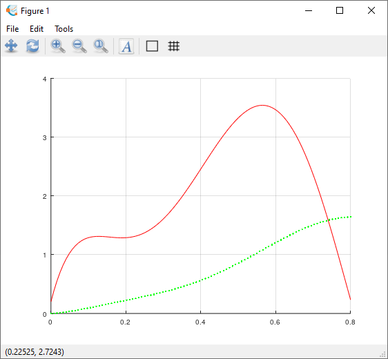
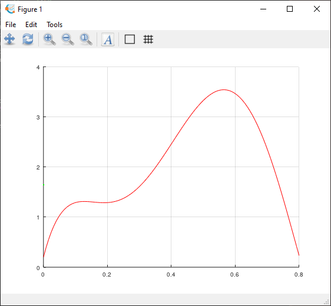
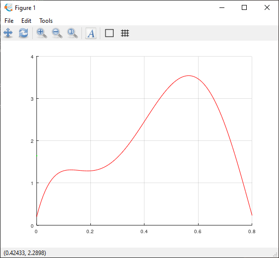
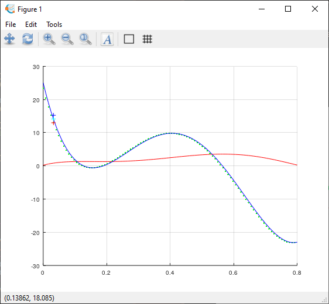

# Labwork 5

DONE: No
Date: October 20, 2022
School: USTH
Subjects: Numerical Methods

# Linear Programming

## Exercise 1

Suppose that a gas-processing plant receives a fixed amount of raw gas each week. The raw gas is processed into grades of heating gas, regular and premium quality. These grades of gas are in high demand (that is, they are guaranteed to sell) and yield different profits to the company. However, their production involves both time and on-site storage constraints. For example, only one of the grades can be produced at a time, and the facility is open for only 80hr/week. Further, there is limited on-site storage for each of the products. All these factors are listed below (note that a metric ton, or tonne, is equal to 1000 kg):



1. Develop a linear programming formulation to maximize the profits for this operation.
2. Minimization of the problem above using function: ********linprog******** in Matlab
3. Demonstrate the feasible function space using the graphical solution of a linear programming problem.

*****Hint: use linspace and meshgrid and plot*****

```matlab
% ©2020 HP.
clc;
clear;
clf;
fprintf('\n--------------------------------------\n')
%--------------------------------------
fprintf('Labwork 5\n');
fprintf('Exercise 1: Linear programming\n\n');
%--------------------------------------
% Demonstrate with graphical solution
x = linspace(0, 6);
y1 = (4*x - 12);
y2 = (4 - x);
y3 = ((10-2*x)/5);
%ytop = min([y1; y2; y3]);
[u, v] = meshgrid(linspace(0,6),linspace(0,6));
hold on;
plot(x, y1, 'r', 'LineWidth', 2)
plot(x, y2, 'r', 'LineWidth', 2);
plot(x, y3, 'r', 'LineWidth', 2);
contour(u,v, 5*u + 2*v, 25);
axis([0 6 0 6]);
hold off;
```

Output:



# Number Integration

## Exercise 2

$$
f(x) = 0.2 + 25x - 200x^2 + 675x^3 - 900x^4 + 400x^5
$$

1. Use Matlab *********trapz********* function to estimate the integral above from 0 to 0.8
2. Use the trapezoidal function in Matlab, *****cumtrapz.***** Compare the difference between two functions
3. Use the simpson function in Matlab, ****quad****
4. Use the quadrature function

```matlab
% ©2020 HP.
function q = quadadapt(f,a,b,tol,varargin)
% Evaluates definite integral of f(x) from a to b if nargin < 4 || isempty(tol),tol = 1.e-6;end
c = (a + b)/2;
fa = feval(f,a,varargin{:});
fc = feval(f,c,varargin{:});
fb = feval(f,b,varargin{:});
 
q = quadstep(f, a, b, tol, fa, fc, fb, varargin{:});
end
function q = quadstep(f,a,b,tol,fa,fc,fb,varargin) % Recursive subfunction used by quadadapt.
h = b - a; c = (a + b)/2;
fd = feval(f,(a+c)/2,varargin{:});
fe = feval(f,(c+b)/2,varargin{:});
q1 = h/6 * (fa + 4*fc + fb);
q2 = h/12 * (fa + 4*fd + 2*fc + 4*fe + fb);
if abs(q2 - q1) <= tol
q = q2 + (q2 - q1)/15;
else
qa = quadstep(f, a, c, tol, fa, fd, fc, varargin{:}); qb = quadstep(f, c, b, tol, fc, fe, fb, varargin{:}); q = qa + qb;
end
end
```

Full source code:

```matlab
% ©2020 HP.
clc;
clear;
clf;
fprintf('\n--------------------------------------\n')
%--------------------------------------
fprintf('Labwork 5\n');
fprintf('Exercise 2: Numerical Integration\n\n');
%--------------------------------------
x = linspace(0,0.8);
x=x';
y = 0.2 + 25*x -200*x.^2 + 675*x.^3 - 900*x.^4 + 400*x.^5;
f = @(x) 0.2 + 25*x -200*x.^2 + 675*x.^3 - 900*x.^4 + 400*x.^5;
%--------------------------------------
Use = 'trapz'
if strcmp(Use,'trapz')>0
    Q = trapz(x,y)
elseif strcmp(Use,'cumtrapz')>0
    Q = cumtrapz(x,y)
elseif strcmp(Use,'quad')>0
    Q = quad(f, 0, 0.8)
elseif strcmp(Use,'quadadapt')>0
    Q = quadadapt(f,0,0.8, 5)
end
%--------------------------------------
hold on
grid on
plot(x, f(x), 'r-')
%xlim([-1 2])
%ylim([-10 10])
plot(x(1:length(Q)), Q, 'g.');
%--------------------------------------
hold off
```

### trapz

```
Use = trapz

Q = 1.6403
```



### cumtrapz

```
--------------------------------------
Labwork 5
Exercise 2: Numerical Integration

Use = cumtrapz
Q =

        0
   0.0024
   0.0062
   0.0113
   0.0174
   0.0244
   0.0323
   0.0408
   0.0498
   0.0593
   0.0691
   0.0792
   0.0895
   0.0999
   0.1104
   0.1210
   0.1316
   0.1421
   0.1527
   0.1632
   0.1737
   0.1842
   0.1946
   0.2050
   0.2154
   0.2258
   0.2362
   0.2467
   0.2573
   0.2680
   0.2788
   0.2898
   0.3010
   0.3125
   0.3242
   0.3362
   0.3486
   0.3614
   0.3745
   0.3881
   0.4021
   0.4167
   0.4317
   0.4473
   0.4635
   0.4802
   0.4975
   0.5155
   0.5341
   0.5533
   0.5731
   0.5936
   0.6147
   0.6365
   0.6589
   0.6819
   0.7055
   0.7297
   0.7544
   0.7797
   0.8055
   0.8318
   0.8585
   0.8856
   0.9131
   0.9408
   0.9689
   0.9972
   1.0256
   1.0542
   1.0828
   1.1114
   1.1399
   1.1683
   1.1964
   1.2243
   1.2519
   1.2791
   1.3058
   1.3319
   1.3574
   1.3822
   1.4063
   1.4295
   1.4518
   1.4732
   1.4935
   1.5127
   1.5308
   1.5477
   1.5633
   1.5775
   1.5905
   1.6020
   1.6121
   1.6207
   1.6279
   1.6335
   1.6376
   1.6403
```



### quad

```
Use = quad
Q = 1.6405
```



### quadadapt

```
Use = quadadapt
Q = 1.6405
```



# Numerical diffrerentiation

## Exercise 3

$$
f(x) = 0.2 + 25x - 200x^2 + 675x^3 - 900x^4 + 400x^5
$$

1. Use Matlab *****diff***** function to differentiate the function *********f(x)********* from
2. Comparison of the exact derivative with numerical estimates
3. Use forward function

```matlab
function d = forward(y,x,p)
    d = (y(p+1)-y(p))/(x(p+1)-x(p));
end
```

d. Use backward function

```matlab
function d = backward(y,x,p)
    d = (y(p)-y(p-1))/(x(p)-x(p-1));
end
```

e. Use central function

```matlab
function d = central(y,x,p)
    d = (y(p+1)-y(p-1))/(x(p+1)-x(p-1));
end
```

*********************Note: Apply only Octave online*********************

Full source code:

```matlab
% ©2020 HP.
clc;
clear;
clf;
fprintf('\n--------------------------------------\n')
%--------------------------------------
fprintf('Labwork 5\n');
fprintf('Exercise 2: Numerical Integration\n\n');
%--------------------------------------
x = linspace(0,0.8);
y = 0.2 + 25.*x -200*x.^2 + 675*x.^3 - 900*x.^4 + 400*x.^5;
f = @(x) 0.2 + 25.*x - 200*x.^2 + 675*x.^3 - 900*x.^4 + 400*x.^5;
df = @(x) 25 - 400*x + 2025*x.^2 - 3600*x.^3 + 2000*x.^4;
%--------------------------------------
function d = forward(y,x,p)
    d = (y(p+1)-y(p))/(x(p+1)-x(p));
end
function d = backward(y,x,p)
    d = (y(p)-y(p-1))/(x(p)-x(p-1));
end
function d = central(y,x,p)
    d = (y(p+1)-y(p-1))/(x(p+1)-x(p-1));
end
%--------------------------------------
Q = diff(f(x))./diff(x);
hold on
grid on
plot(x, f(x), 'r-')
%xlim([-1 2])
%ylim([-10 10])
plot(x(1:length(Q)), Q, 'g.');
plot(x, df(x), 'b-')
%--------------------------------------
p = 5
d_forward = forward(y,x,p)
plot(x(p), d_forward, 'r+')
%--------------------------------------
d_backward = backward(y,x,p)
plot(x(p), d_backward, 'b+')
%--------------------------------------
d_central = central(y,x,p)
plot(x(p), d_central, 'c+')
%--------------------------------------
hold off
```



Output:

```
Labwork 5
Exercise 2: Numerical Integration

p = 5
d_forward = 12.972
d_backward = 15.236
d_central = 14.104
```