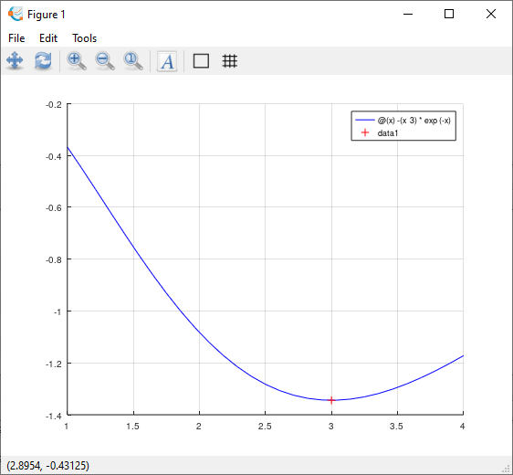
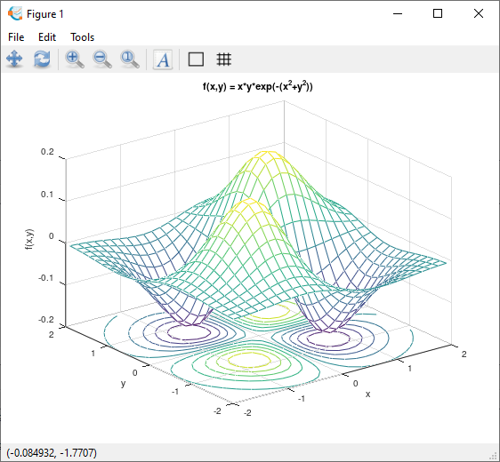
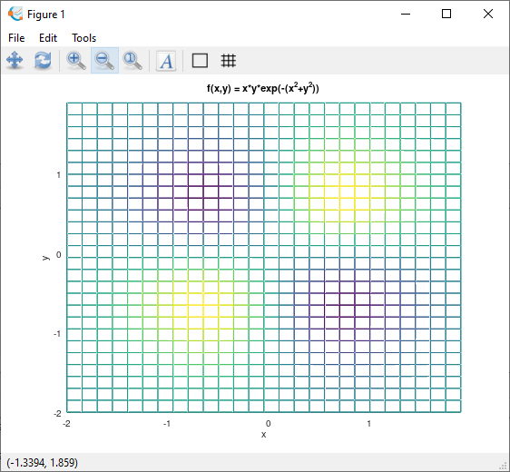
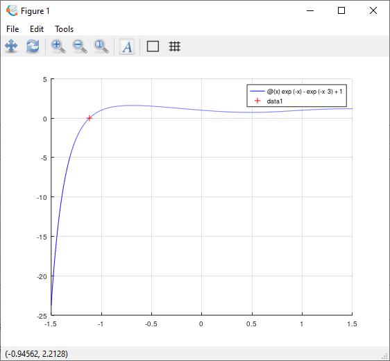

# Labwork 6

DONE: Yes
Date: October 19, 2022
School: USTH
Subjects: Numerical Methods

# Exercise 1

1. Find the minimum of the function $f(x) = -x^3 e^{-x}$ on the interval $1 \leq x \leq 4$ by using function `fminbnd` with the options:

```matlab
options=optimset('Display','Iter','TolFun',1e-8);
```

b. How many iterations does it take to find the minimum of the function f?

c. Plot the graph of the function on the above interval to visualize the results.

```matlab
% 2022 Hien PHAN
clc;
clear;
clf;
%-------------------------
f = @(x) -(x^3)*exp(-x)
a = 1
b = 4
options = optimset('Display','iter','TolFun',1e-8);

hold on

[x, fval, info, output] = fminbnd (f, a, b, options)

fprintf('Minf=%.4f at x=%.4f', fval, x);
%---------------------------
fplot(f, [1 4], 'b-');
plot(x, f(x), 'r+');
grid on
hold off
```

Output:

```
f =

@(x) -(x ^ 3) * exp (-x)

a = 1
b = 4

 Func-count     x          f(x)         Procedure
    1        2.85410    -1.33933	initial
    2        3.29180    -1.32644	golden
    3        3.01452    -1.34420	parabolic
    4        3.00472    -1.34424	parabolic
    5        3.00029    -1.34425	parabolic
    6        2.99999    -1.34425	parabolic
    7        3.00003    -1.34425	parabolic
    8        2.99996    -1.34425	parabolic

Optimization terminated:
 the current x satisfies the termination criteria using OPTIONS.TolX of 1.000000e-04

x = 3.0000
fval = -1.3443
info = 1
output =

  scalar structure containing the fields:

    iterations = 8
    funcCount = 9
    algorithm = golden section search, parabolic interpolation
    bracket =

       3.0000   3.0000

Minf=-1.3443 at x=3.0000
```



# Exercise 2

1. Find the minimum of the function $f(x) = xye^{-x(x^2 + y^2)}$ by using the function `fminsearch`. Display the iterations and set the value $10^{-8}$ as the value for the `'TolFun'` option.
2. How many iterations does it take to find the results?
3. Plot the graph of the function on the region $[-2, 2] * [-2, 2]$ to visualize the results. Is there another value of (x, y) at which the function obtains its minimum value?

```matlab
% 2022 Hien PHAN
clc;
clear;
clf;
%------------------------------
f = @(xy) xy(1)*xy(2)*exp(-(xy(1)^2+xy(2)^2))

options = optimset('Display','iter','TolFun',1e-8);

%---------------------------------
%hold on
[xy, fval, exitflag, output] = fminsearch(f, [0; 0])
xy(1)
xy(2)
%--------------------------------
x = [-2:.15:2];
y = [-2:.15:2];
[xx, yy] = meshgrid (x, y);
z = xx.*yy.*exp(-(xx.^2+yy.^2));

mesh(x, y, z)
meshc(xx, yy, z)
xlabel ("x");
ylabel ("y");
zlabel ("f(x,y)");
title ("f(x,y) = x*y*exp(-(x^2+y^2))");

%grid on

%hold off
```

Output:

```
f =

@(xy) xy (1) * xy (2) * exp (-(xy (1) ^ 2 + xy (2) ^ 2))

xy =

  -0.7071
   0.7072

fval = -0.1839
exitflag = 1
output =

  scalar structure containing the fields:

    iterations = 33
    funcCount = 70
    algorithm = Nelder-Mead simplex direct search
    message = Algorithm converged.  Simplex size 9.4663e-05 <= 1.0000e-04 and step in function value 1.8986e-09 <= 1.0000e-04

ans = -0.7071
ans = 0.7072
```



If you uncomment hold on, grid on and hold off, the result is:



# Exercise 3

1. Find the root of the function $f(x) = e^{-x} - e^{-x^3} + 1$ by using the function `fzero`. Set the initial guess at $x_0 = 2$. Using the `optimset` function to display the iterations and set the value $10^{-4}$ as the value for the `'TolFun'` option. How many iterations does it take to find the root?
2. Plot the graph of the function on the region [0, 1] to visualize the result. How does the map change if we change the upper bound to 5, 10, 100 and if we change the lower bound to -1, -5, -10?

```matlab
% 2022 Hien PHAN
clc;
clear;
clf;
%----------------------------
f = @(x) exp(-x)-exp(-x^3)+1

options = optimset('Display','iter','TolFun',1e-4);

hold on
[x, fval, info, output] = fzero (f, 1, options)
%------------------------------

fplot(f, [-1.5 1.5], 'b');
plot(x, f(x), 'r+');
grid on
hold off
```

Output:

```
f =

@(x) exp (-x) - exp (-x ^ 3) + 1

Search for an interval around 1 containing a sign change:
 Func-count    a          f(a)             b          f(b)        Procedure
    1               1             1             1             1   initial interval
    2               1             1          0.99      0.992607   search
    3               1             1         1.025       1.01814   search
    4               1             1          0.95      0.962467   search
    5               1             1           1.1       1.06866   search
    6               1             1          0.75      0.816551   search
    7               1             1           1.5       1.18891   search
    8               1             1             0             1   search
    9               1             1           3.5        1.0302   search
   10               1             1            -4  -6.23515e+27   search

Search for a zero in the interval [-4, 1]:
 Func-count    x          f(x)             Procedure
   10               1             1        initial
   11            -1.5      -23.7426        interpolation
   12               1             1        interpolation
   13       -0.283529       1.30475        interpolation
   14       -0.410264       1.43572        interpolation
   15       -0.670861       1.60346        interpolation
   16       -0.816674       1.53889        interpolation
   17       -0.899863       1.38695        interpolation
   18        -1.19993      -1.30783        interpolation
   19        -1.19741      -1.25537        interpolation
   20        -1.09979      0.221619        interpolation
   21        -1.12908     -0.125301        interpolation
   22         -1.1195   -0.00424425        interpolation
   23        -1.11915   4.18194e-06        interpolation
   24        -1.11915  -4.17224e-06        interpolation
   25        -1.11915  -8.88178e-16        interpolation
   26        -1.11915   1.28786e-14        interpolation

Algorithm converged.

x = -1.1192
fval = 1.2879e-14
info = 1
output =

  scalar structure containing the fields:

    iterations = 16
    funcCount = 26
    algorithm = bisection, interpolation
    bracketx =

      -1.1192  -1.1192

    brackety =

      -8.8818e-16   1.2879e-14
```

