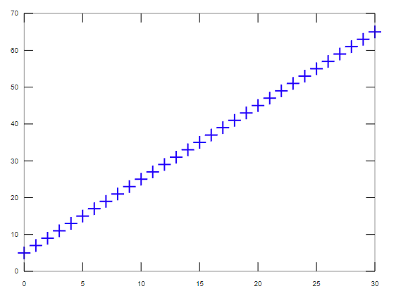
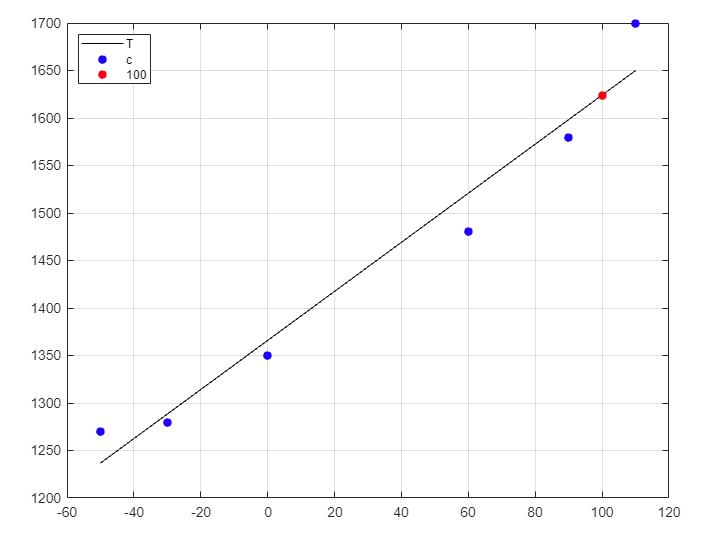
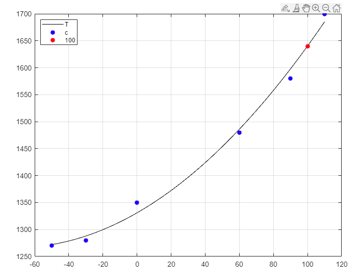
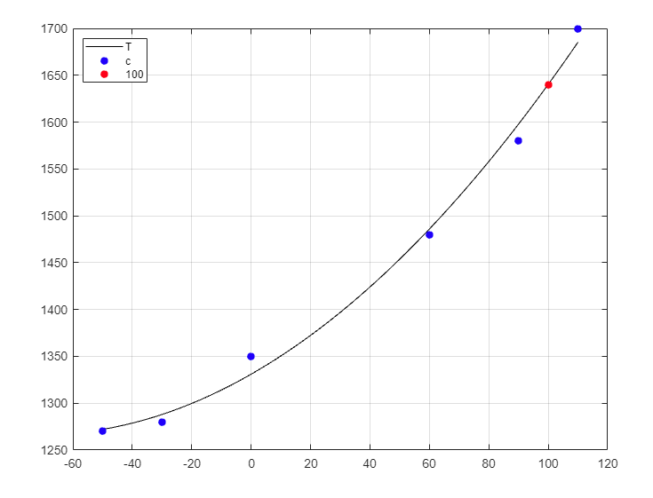

# Question 1

1. Calculate the arithmetic operations below:

i. $11^3 + 15! - \sqrt{AAA}$; where AAA is the last 3 digits of your student ID. (Example BA10-002: AAA = 002

ii. Define a **************column************** vector x = (1, 2, 3, 4, 5); Transpose this vector.

```matlab
clc;
clear;

y = 11^3 + factorial(15) - sqrt(2);
fprintf("y = %.5f");
disp(y);
x = [1 2 3 4 5];
x'
```

Output: 

```
y = 1.3077e+12
ans =

   1
   2
   3
   4
   5
```

b. Calculate the matrix:

1. Sum of A and B

$A = \begin{bmatrix}1 & 2 & 3 \\4 & 5 & 6 \\7 & 8 & 9 \\\end{bmatrix}$                       $B = \begin{bmatrix}
1 & 1 & AAA \\
0 & 1 & 0 \\
0 & 0 & 1 \\
\end{bmatrix}$            

ii. Find the transpose of the matrix C = (A+B)

iii. Find the inverse of the matrix D = (A - B)

iv. Reduce the size of D to 2x2 by removing row 3 and column 3 of the original matrix using operator “:” 

where AAA is the last 3 digits of your student ID. (Example BA10-002: AAA = 002)

```matlab
clc;
clear;

A = [1 2 3; 4 5 6; 7 8 9];
B = [1 1 2; 0 1 0; 0 0 1];
fprintf('Sum of A and B\n')
C = (A+B);
fprintf("C = \n");
disp(C');
fprintf('Inverse of the matrix D\n')
D = inv(A-B);
fprintf("D = \n");
disp(D);
fprintf('Reduce the size of D to 2x2 by removing row 3 and column 3 of the original matrix using operator\n')
D(:,3) = [];
fprintf("reduce_column = \n");
disp(D);

D(3,:) = [];
fprintf("reduce_row = \n");
disp(D);
```

Output:

```
Sum of A and B
C = 
    2    4    7
    3    6    8
    5    6   10
Inverse of the matrix D
D = 
  -1.1429        0   0.1429
   0.7143  -0.5000   0.2857
   0.2857   0.5000  -0.2857
Reduce the size of D to 2x2 by removing row 3 and column 3 of the original matrix using operator
reduce_column = 
  -1.1429        0
   0.7143  -0.5000
   0.2857   0.5000
reduce_row = 
  -1.1429        0
   0.7143  -0.5000
```

c. Given the line-equation on 2-D plane: y = 2x + 5. Compute y for x = 0, 1, 2, …, 30 and plot those (x,y) points on 2-D plane by command “plot()”

```matlab
clc;
clear;
%c
fprintf('Part c\n')
x=0:1:30
y = @(x) 2*x + 5
fprintf('Value of y of x = 0, 1, 2, ... , 30: ')
disp(y(x))
plot(x,y(x),'b+')
```

Output:

```
Part c
x =

 Columns 1 through 16:

    0    1    2    3    4    5    6    7    8    9   10   11   12   13   14   15

 Columns 17 through 31:

   16   17   18   19   20   21   22   23   24   25   26   27   28   29   30

y =

@(x) 2 * x + 5

Value of y of x = 0, 1, 2, ... , 30:  Columns 1 through 16:

    5    7    9   11   13   15   17   19   21   23   25   27   29   31   33   35

 Columns 17 through 31:

   37   39   41   43   45   47   49   51   53   55   57   59   61   63   65
```



d. Write a script file to solve equation $\sqrt{x} - x + 1 = 0$ using ***************solve***************. Note that the equation to be solved is specified as a string; Get the numerical solutions using function ******double******?

```matlab
%d
clc;
clear;
fprintf('Part d: Write a script file to solve equation sqrt(x) - x + 1 = 0 using solve function\n')
syms x
f = sqrt(x) - x + 1
r = solve(f,x)
fprintf('Numerical soluton: ')
disp(double(r))
```

Output:

```
Part d: Write a script file to solve equation sqrt(x) - x + 1 = 0 using solve function
Symbolic pkg v2.9.0: Python communication link active, SymPy v1.5.1.
f = (sym) √x - x + 1
r = (sym)

  √5   3
  ── + ─
  2    2

Numerical soluton: 2.6180
```

# Question 2

a) The volume of liquid *V* in a hollow horizontal cylinder of radius *r* and length **L** is related to the depth of the liquid *h* by:

$$
V = \left[r^2cos^{-1}\left(\frac{r-h}{r} \right) - (r - h)\sqrt{2rh - h^2} \right]L
$$

Determine **h** given **r** = 2.2 m, **L** = 5m, and *V* = $8m^3$

```matlab
clc
fprintf('Part a: The volume of liquid V in a hollow horizontal cylinder of radius r and length L is related to the depth of the liquid h\n')
r=2.2; L=5; V=8;
f=@(h) V-(r^2*acos((r-h)/r)-(r-h)*sqrt(2*r*h-h^2))*L;
h=fzero(f,1);
fprintf('solution:')
disp(h)
```

Output:

```
Part a: The volume of liquid V in a hollow horizontal cylinder of radius r and length L is related to the depth of the liquid h
solution:0.7132
```

```
Part a: The volume of liquid V in a hollow horizontal cylinder of radius r and length L is related to the depth of the liquid h
solution:0.7132
```

b) Use the function **********newtraph.m********** to find the root of the function $y = x^2 - AAA$ where ***AAA*** is the last 3 digits of your student ID (Example BA10-002: AAA = 002)

```matlab
function [root,ea,iter]=newtraph(func,dfunc,xr,es,maxit)
% newtraph: Newton-Raphson root location zeroes [root,ea,iter]=newtraph(func,dfunc,xr,es,maxit,p1,p2,...):
% uses Newton-Raphson method to find the root of func
% input:
% func = name of function
% dfunc = name of derivative of function
% xr = initial guess
% es = desired relative error (default = 0.0001%)
% maxit = maximum allowable iterations (default = 50)
% p1,p2,... = additional parameters used by function
% output:
% root = real root
% ea = approximate relative error (%)
% iter = number of iterations
iter = 0;
while(1)
xrold = xr;
xr = xr - func(xr)/dfunc(xr);
iter = iter + 1;
if xr ~= 0, ea = abs((xr - xrold)/xr) * 100; end
if ea <= es || iter >= maxit, break, end
end
root = xr;
```

```matlab
clc;
fprintf('Part b: Use the function newtraph.m to find the root of the function y = x^2 - AAA where is the last 3 digits of your student ID.');
func = @(x) x^2 - 2;
dfunc = @(x) 2*x;
xr = 11;
es = 0.0002;
maxit = 10;
disp('root of the function x^2 - 2:');
[root,ea,iter]=newtraph(func,dfunc,xr,es,maxit)
```

Output:

```matlab
Part b: Use the function newtraph.m to find the root of the function y = x^2 - AAA where is the last 3 digits of your student ID.root of the function x^2 - 2:
root = 1.4142
ea = 1.3013e-05
iter = 7
```

c) Write a script file to computes and display $1 - \frac{1}{3} + \frac{1}{5} - \frac{1}{7} + \frac{1}{9} - ... - \frac{1}{1003}$ using ********for******** statement

```matlab
clc;
clear;
fprintf('compute 1 - 1/3 + 1/5 - 1/7 + 1/9 - ... - 1/1003\n')
sum = 0;
for k=1:4:1001
    sum=sum+1/k;
end
for k=3:4:1003
    sum=sum-1/k;
end
fprintf('sum is: ')
disp(sum)
```

Output:

```
compute 1 - 1/3 + 1/5 - 1/7 + 1/9 - ... - 1/1003
sum is: 0.7849
```

d) Solve the system of linear equation using ********inv******** and ******************mldivide****************** in Matlab:

$$
2x + y + 4z = 10 \newline x + 2y - 5z = 1 \newline 3x - 2y - 4z = 8
$$

```matlab
clc
clear all
close all
fprintf('Solve the system of linear equation using inv and mldivide in Matlab\n')
%%
A = [2 1 4; 1 2 -5; 3 -2 -4];
B = [10; 1; 8];
%
% x = naiv_gauss(A,B)
% mldivide method

y = A\B
fprintf("y = \n");
disp(y);
% inv method

inverse = inv(y);
fprintf("inverse = \n");
disp(inverse);
```

Output:

```
Solve the system of linear equation using inv and mldivide in Matlab
y =

   3.6456
   0.2278
   0.6203

y =
   3.6456
   0.2278
   0.6203
```

# Question 3

1. You perform experiments and determine the following values of heat capacity *c* at various temperatures *T* for a gas:

| T | -50 | -30 | 0 | 60 | 90 | 110 |
| --- | --- | --- | --- | --- | --- | --- |
| c | 1270 | 1280 | 1350 | 1480 | 1580 | 1700 |

Determine the heat capacity *c* at 100 degree Celsius using:

1. Use the function “fit()” in matlab. Plot result
2. Use the function “polyfir()” in matlab. Plot results.
3. Use the function “lsqcurvefit()” in matlab. Plot results.

```matlab
%Exercise 3
clc
%a
fprintf('Part a');
T=[-50 -30 0 60 90 110]; 
c=[1270 1280 1350 1480 1580 1700]; 
c0=100;

%%
fprintf('Part i: Use fit function');
f=fit(T',c','poly1')
func=@(x) f.p1*x+f.p2
figure 
hold on
grid on
box on
fplot(func, [-50 110],'k')
plot(T',c','b*','LineWidth',2);
plot(c0, func(c0), 'r*', 'LineWidth',2);
legend('T', 'c', '100','Location', 'northwest')
hold off
fprintf('the heat capacity c at 100oC');
func(c0)
fprintf('Part ii: Use polyfit function');
%%
f=polyfit(T,c,2);
func=@(x) f(1)*x^2+f(2)*x+f(3)
figure 
hold on
grid on
box on
fplot(func, [-50 110],'k')
plot(T',c','b*','LineWidth',2);
plot(c0, func(c0), 'r*', 'LineWidth',2);
legend('T', 'c', '100','Location', 'northwest')
hold off
fprintf('the heat capacity c at 100oC');
func(c0)

fprintf('Part iii: Use function');
d=@(f,x) f(1)*x+f(2);
a=lsqcurvefit(d,[2;3],T,c);
figure 
hold on
grid on
box on
fplot(func, [-50 110],'k')
plot(T',c','b*','LineWidth',2);
plot(c0, func(c0), 'r*', 'LineWidth',2);
legend('T', 'c', '100','Location', 'northwest')
hold off
fprintf('the heat capacity c at 100oC');
func(c0)
```

*******************************Note: Using matlab to run code.*******************************

Output:

```
Part aPart i: Use fit function

f = 

     Linear model Poly1:
     f(x) = p1*x + p2
     Coefficients (with 95% confidence bounds):
       p1 =       2.583  (1.858, 3.307)
       p2 =        1366  (1317, 1415)

func =

  function_handle with value:

    @(x)f.p1*x+f.p2

the heat capacity c at 100oC
ans =

   1.6241e+03

Part ii: Use polyfit function
func =

  function_handle with value:

    @(x)f(1)*x^2+f(2)*x+f(3)

Warning: Function behaves unexpectedly on array inputs. To improve performance, properly vectorize your function to return an output with the same size and shape as the input arguments. 
> In matlab.graphics.function.FunctionLine>getFunction
In matlab.graphics.function/FunctionLine/updateFunction
In matlab.graphics.function/FunctionLine/set.Function_I
In matlab.graphics.function/FunctionLine/set.Function
In matlab.graphics.function.FunctionLine
In fplot>singleFplot (line 245)
In fplot>@(f)singleFplot(cax,{f},limits,extraOpts,args) (line 200)
In fplot>vectorizeFplot (line 200)
In fplot (line 166)
In Ex3a (line 32) 
the heat capacity c at 100oC
ans =

   1.6403e+03

Part iii: Use function

Local minimum possible.

lsqcurvefit stopped because the final change in the sum of squares relative to 
its initial value is less than the value of the function tolerance.

<stopping criteria details>
Warning: Function behaves unexpectedly on array inputs. To improve performance, properly vectorize your function to return an output with the same size and shape as the input arguments. 
> In matlab.graphics.function.FunctionLine>getFunction
In matlab.graphics.function/FunctionLine/updateFunction
In matlab.graphics.function/FunctionLine/set.Function_I
In matlab.graphics.function/FunctionLine/set.Function
In matlab.graphics.function.FunctionLine
In fplot>singleFplot (line 245)
In fplot>@(f)singleFplot(cax,{f},limits,extraOpts,args) (line 200)
In fplot>vectorizeFplot (line 200)
In fplot (line 166)
In Ex3a (line 47) 
the heat capacity c at 100oC
ans =

   1.6403e+03
```







b. Given the function $(x) = 2 + x^2 + e^{2x+1}$. Use the forward difference formula to differentiate the function f(x) with the step 0.1 and 0.01

```matlab
clc;
clear;
%b
%%
fprintf('Part b: Use the forward difference formula to differentiate the function f(x)\n')
f = @(x) 2 + x^2 + exp(2*x+1)

fprintf('Choose x0 = 1.41')
x0 = 1.41;
h = 0.1
fprintf('With step 0.1.\ndf(x)/dx=(f(xi+1)-f(x))/h\nResult: ')

df = (f(x0+h)-f(x0))/h

h = 0.01
fprintf('With step 0.01.\ndf(x)/dx=(f(xi+1)-f(x))/h\nResult:')
df=(f(x0+h)-f(x0))/h;
disp(df)
```

Output:

```
Part b: Use the forward difference formula to differentiate the function f(x)
f =

@(x) 2 + x ^ 2 + exp (2 * x + 1)

Choose x0 = 1.41h = 0.1000
With step 0.1.
df(x)/dx=(f(xi+1)-f(x))/h
Result: df = 103.89
h = 0.010000
With step 0.01.
df(x)/dx=(f(xi+1)-f(x))/h
Result:94.957
```

c. Calculate the integral of $f(x)$ from 0 to 0.8: $f(x) = AAA + 25x - x^2$

1. Use ******trapz****** function
2. Use *****quad***** function
3. Use the Gauss-quadrature method with 2 points Gauss.

(where AAA is the last 3 digits of your student ID. Example BA10-002: AAA = 002).

```matlab
% ©2020 HP.
clc;
clear;
clf;
fprintf('\n--------------------------------------\n')
%--------------------------------------
fprintf('Exercise 3c: Calculate the integral of f(x) from 0 to 0.8: f(x) = 2 + 25x - x^2\n\n');
%--------------------------------------
x = linspace(0,0.8);
x=x';
y = 2 + 25*x - x.^2;
f = @(x) 2 + 25*x - x.^2;
%--------------------------------------
Use = 'trapz'
if strcmp(Use,'trapz')>0
  Q = trapz(x,y)
elseif strcmp(Use,'cumtrapz')>0
  Q = cumtrapz(x,y)
elseif strcmp(Use,'quad')>0
  Q = quad(f, 0, 0.8)
elseif strcmp(Use,'quadadapt')>0
  Q = quadadapt(f,0,0.8, 5)
end
%--------------------------------------
hold on
grid on
plot(x, f(x), 'r-')
%xlim([-1 2])
%ylim([-10 10])
plot(x(1:length(Q)), Q, 'g.');
%--------------------------------------
hold off
```

```matlab
% ©2020 HP.
clc;
clear;
clf;
fprintf('\n--------------------------------------\n')
%--------------------------------------
fprintf('Exercise 3c: Calculate the integral of f(x) from 0 to 0.8: f(x) = 2 + 25x - x^2\n\n');
%--------------------------------------
x = linspace(0,0.8);
x=x';
y = 2 + 25*x - x.^2;
f = @(x) 2 + 25*x - x.^2;
%--------------------------------------
Use = 'quad'
if strcmp(Use,'trapz')>0
  Q = trapz(x,y)
elseif strcmp(Use,'cumtrapz')>0
  Q = cumtrapz(x,y)
elseif strcmp(Use,'quad')>0
  Q = quad(f, 0, 0.8)
elseif strcmp(Use,'quadadapt')>0
  Q = quadadapt(f,0,0.8, 5)
end
%--------------------------------------
hold on
grid on
plot(x, f(x), 'r-')
%xlim([-1 2])
%ylim([-10 10])
plot(x(1:length(Q)), Q, 'g.');
%--------------------------------------
hold off
```

```matlab
% Matlab program for Gauss-Quadrature 2-Point Formula
clc;
clear all;
disp('OUTPUT:');
E=input('Enter f(x):','s');
f=inline(E);
a=input('Enter lower limit:');
b=input('Enter upper limit:');
w1=1;w2=1;z1=-1/sqrt(3);z2=1/sqrt(3);
x1=(b-a)/2*z1+(b+a)/2;
x2=(b-a)/2*z2+(b+a)/2;
I=(b-a)/2.0*(w1*f(x1)+w2*f(x2));
fprintf('Integration of given function is=%f\n',I);
```

Output:

```
Exercise 3c: Calculate the integral of f(x) from 0 to 0.8: f(x) = 2 + 25x - x^2

Use = trapz
Q = 9.4293

Use = quad
Q = 9.4293
```
